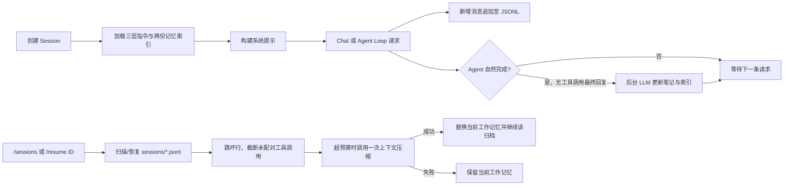
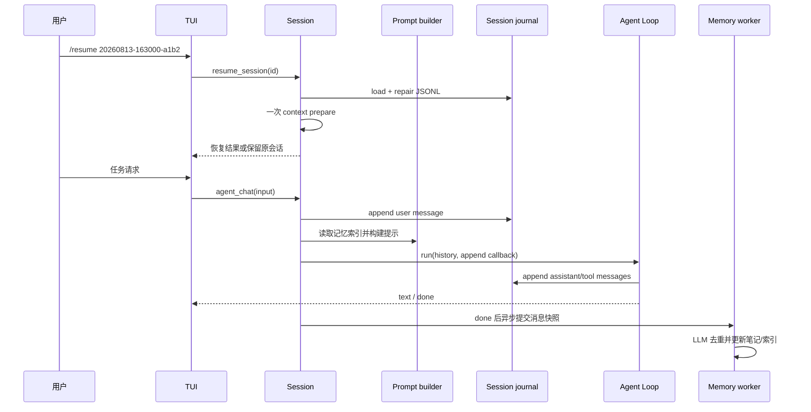

# 会话恢复与分层记忆 Plan

## 架构概览

本章新增三个本地子系统，并通过 `Session` 作为唯一的编排入口：

1. **指令与长期记忆**：在 `flickcode.memory` 中加载三层手写指令、管理项目/用户两套自动笔记及索引，并向系统提示注入内容。
2. **会话归档与恢复**：在 `flickcode.sessions` 中追加保存 JSONL、从 JSONL 推导会话列表、修复可恢复历史并执行过期清理。
3. **Session 集成**：创建时只加载指令和长期记忆；每条新增历史消息写入当前会话归档；`/sessions`、`/resume` 通过 `Session` 调用归档服务；Agent Loop 成功自然结束后，由后台工作器更新记忆。



`Session` 继续持有运行时 `messages`，而归档、提示和笔记子系统不依赖任何 Provider 专用消息格式；全部使用现有的内部 `Message`。Provider 仍然负责最后一步的 OpenAI/Anthropic 格式转换。

## 路径与持久化约定

所有项目路径均由创建 `Session` 时的 `Path.cwd().resolve()` 得到的项目根目录推导，之后不再接受来自命令输入的任意文件路径。

| 用途 | 位置 | 说明 |
|---|---|---|
| 项目根指令 | `<project>/AGENTS.md` | 项目级、优先级最高的第一层 |
| 项目工具指令 | `<project>/.flickcode/AGENTS.md` | 项目级、第二层 |
| 用户指令 | `~/.flickcode/AGENTS.md` | 用户级、第三层 |
| 项目会话 | `<project>/sessions/<session-id>.jsonl` | 仅由 FlickCode 管理的追加归档 |
| 项目笔记 | `<project>/memory/*.md` 与 `index.md` | 仅当前项目注入 |
| 用户笔记 | `~/.flickcode/memory/*.md` 与 `index.md` | 跨项目注入 |

指令由高到低按表中顺序拼接；两个项目级来源都位于用户级来源之前。选择 `AGENTS.md` 是为了使手写规则在项目根、工具目录和用户目录中具有同名、易发现的约定。缺失的文件不会创建，也不会视为错误。

会话 ID 为 `YYYYMMDD-HHMMSS-xxxx`，其中时间使用本地创建时间、`xxxx` 为小写十六进制随机后缀。会话文件延迟到第一条消息需要落盘时创建，因此只运行 `/sessions` 或直接退出不会留下空会话文件。

### JSONL 事件格式

会话文件本身是唯一元数据来源，不创建 `.meta`、数据库或会话索引。每行是一个独立 JSON 对象，使用 UTC ISO 8601 时间戳：

```json
{"schema":1,"kind":"session_started","timestamp":"2026-08-13T08:30:00Z","session_id":"20260813-163000-a1b2"}
{"schema":1,"kind":"message","timestamp":"2026-08-13T08:30:02Z","message":{"role":"user","content":"修复测试","tool_call_id":"","tool_calls":[]}}
{"schema":1,"kind":"message","timestamp":"2026-08-13T08:30:05Z","message":{"role":"assistant","content":"我会先检查测试。","tool_call_id":"","tool_calls":[]}}
{"schema":1,"kind":"session_resumed","timestamp":"2026-08-14T02:00:00Z","session_id":"20260813-163000-a1b2"}
```

- `session_started` 和 `session_resumed` 是会话文件内的事件，不是单独维护的 meta 状态。
- `message` 使用内部 `Message` 的完整可序列化字段；`tool_calls` 保持列表，工具结果使用 `role="tool"` 与 `tool_call_id`。
- 每次追加均以一行 JSON 和换行完成、随后 flush；写失败返回诊断，不回滚内存历史。
- 标题由首条合法用户消息压缩为空白后的前 80 个字符推导；消息数为合法 `message` 事件数；最后活动时间取最后一条具有有效时间戳的事件，必要时回退文件修改时间。

## 核心数据结构与接口

### 配置

在 `flickcode.config` 增加 `MemoryConfig` 并作为 `Config.memory` 提供。现有用户配置文件中的 `memory:` 可覆盖以下数字型设置；项目 `config.yaml` 继续只参与现有 MCP 合并，避免扩大其既有语义。

```python
@dataclass
class MemoryConfig:
    instruction_filename: str = "AGENTS.md"
    include_max_depth: int = 5
    resume_time_gap_days: int = 7
    session_expiry_days: int = 30
    index_max_lines: int = 200
    index_max_bytes: int = 25 * 1024

@dataclass
class Config:
    providers: List[ProviderConfig]
    mcp_servers: dict[str, MCPServerConfig]
    mcp_errors: list[str]
    context: ContextConfig
    memory: MemoryConfig
```

`_parse_memory()` 验证配置为映射且所有数值为正整数；索引上限保留为默认安全边界，不允许配置成比规范更大的值。默认配置模板写出可调整的 `include_max_depth` 与 `resume_time_gap_days`，并保留 30 天和 200 行/25 KB 的固定策略值。

### 指令加载器

`flickcode.memory.instructions` 负责受限文件展开：

```python
@dataclass
class InstructionDiagnostic:
    source: Path
    line: int | None
    message: str

@dataclass
class InstructionBundle:
    project_text: str
    user_text: str
    diagnostics: list[InstructionDiagnostic]

class InstructionLoader:
    def load(self, project_root: Path) -> InstructionBundle: ...
```

加载器按上述三份根文件顺序处理。每个文件中的整行 `@include <relative-markdown-path>` 或 `@include relative-markdown-path` 在当前位置展开。对每个根文件调用传入其允许根：项目级为项目根，用户级为 `~/.flickcode`。展开前执行以下检查：

1. 路径必须相对且解析后的规范路径仍位于允许根内；
2. 当前递归深度不得超过 `include_max_depth`；
3. 本次加载范围内的 `visited` 集合不得已含该规范路径；
4. 目标必须是可读取的 Markdown 常规文件。

被拒绝的 include 留下一条诊断，原 `@include` 指令不进入提示；同一文件被再次引用仅记录一次跳过诊断。读取根文件失败也只产生诊断。路径包含关系通过兼容 Python 3.8 的 `relative_to()` 检查实现，而非字符串前缀比较。

### 会话归档与恢复

`flickcode.sessions` 分为写入/扫描和恢复两个模块：

```python
SESSION_ID_RE: Pattern[str]

@dataclass
class ArchiveDiagnostic:
    path: Path | None
    line: int | None
    message: str

@dataclass
class SessionSummary:
    session_id: str
    title: str
    message_count: int
    last_activity: datetime
    recoverable: bool
    reason: str = ""

@dataclass
class ResumeResult:
    messages: list[Message]
    diagnostics: list[ArchiveDiagnostic]
    truncated: bool
    inserted_time_gap_notice: bool
    last_activity: datetime | None

class SessionJournal:
    def new_pending(self) -> str: ...
    def append_message(self, session_id: str, message: Message) -> list[ArchiveDiagnostic]: ...
    def mark_resumed(self, session_id: str) -> list[ArchiveDiagnostic]: ...
    def list_sessions(self) -> tuple[list[SessionSummary], list[ArchiveDiagnostic]]: ...
    def prune_expired(self, active_session_id: str | None) -> list[ArchiveDiagnostic]: ...

class SessionRecovery:
    def load(self, session_id: str, now: datetime) -> ResumeResult: ...
```

`SessionJournal` 使用完整匹配的 ID 正则构造目标文件，解析后再次确认路径位于 `sessions` 根目录，因而 `/resume` 无法传入路径、扩展名或遍历片段。`list_sessions()` 单独扫描每个命名合法的 `.jsonl` 文件；异常文件会标为不可恢复并附原因，但不会中止整个列表。

`SessionRecovery.load()` 从头扫描一个文件，逐行验证 JSON、事件类型、时间戳及 `Message` 所需字段。坏行跳过并携带行号诊断。它随后运行独立的工具调用完整性状态机：

- assistant 的 `tool_calls` 建立等待结果的 ID 集合和其起始索引；
- 期间允许 `thinking` 消息；匹配的 tool 结果逐一移除等待 ID；
- 孤立 tool 结果被跳过并记录诊断；
- 在下一条普通用户/assistant 消息出现前仍有等待 ID，或扫描结束仍有等待 ID 时，结果在起始 assistant 工具调用前截断；该点之后的记录不进入恢复历史。

当最后活动时间距 `now` 超过 `resume_time_gap_days`（默认已批准为 7 天）时，恢复结果在历史尾部追加不落盘的 `Message(role="user")` 时间跨度提醒，明确要求模型在依赖外部状态前重新确认。这样每次跨时段恢复都会有一个提醒，而不会重复写入归档。

### 长期笔记和索引

`flickcode.memory.notes` 管理两个独立 `MemoryRepository` 实例（项目、用户）。每条笔记为一个独立 Markdown 文件：

```markdown
---
id: 20260813-163000-a1b2
category: project_knowledge
created_at: 2026-08-13T08:30:00Z
updated_at: 2026-08-13T08:30:00Z
---

本项目使用 unittest，新增功能应提供不依赖真实 Provider 的测试。
```

```python
class MemoryCategory(str, Enum):
    USER_PREFERENCE = "user_preference"
    CORRECTION_FEEDBACK = "correction_feedback"
    PROJECT_KNOWLEDGE = "project_knowledge"
    REFERENCE = "reference"

@dataclass
class MemoryNote:
    note_id: str
    category: MemoryCategory
    content: str
    created_at: datetime
    updated_at: datetime

class MemoryRepository:
    def read_index(self) -> tuple[str, list[MemoryDiagnostic]]: ...
    def read_notes_for_update(self) -> tuple[list[MemoryNote], list[MemoryDiagnostic]]: ...
    def apply(self, changes: list[MemoryChange]) -> list[MemoryDiagnostic]: ...
```

笔记更新可新建或更新由 LLM 选择的既有 ID，拒绝未知 ID、非法类别和空正文。笔记文件使用临时同目录文件加原子替换写入；每个 repository 在进程内通过按目录划分的锁串行写入。每次成功变更后，从当前有效笔记确定性重建 `index.md`：按最近更新时间排序，条目含 ID、类别、更新时间和受限摘要。若超过 200 行或 25 KB，保留可容纳的最新条目并停止；被裁剪的笔记文件仍保留，因而可追溯且不会在索引裁剪时丢失事实。

### 异步 LLM 笔记更新

`flickcode.memory.updater` 复用 Provider 的无工具直接调用方式，但与会话主请求隔离：

```python
@dataclass
class MemoryChange:
    scope: Literal["user", "project"]
    action: Literal["upsert", "discard"]
    note_id: str | None
    category: MemoryCategory | None
    content: str = ""

class MemoryUpdateClient:
    def propose(
        self,
        messages: list[Message],
        user_notes: list[MemoryNote],
        project_notes: list[MemoryNote],
    ) -> list[MemoryChange]: ...

class MemoryUpdateScheduler:
    def submit(self, messages: list[Message]) -> None: ...
    def shutdown(self) -> None: ...
```

更新系统提示要求模型只返回已验证的 JSON 变更集合，且只允许四种类别。它收到本轮消息快照以及两个 scope 的已有笔记，决定每条候选事实是 `discard`、合并到某个既有笔记，还是创建笔记；重复判断因此完全由 LLM 做出。解析器限制变更数量和正文大小，拒绝任何无效 JSON 或越权 scope。仓库仅根据验证通过的变更写文件并重建对应索引。

调度器使用每个 `Session` 一个单线程后台执行器，保证同一会话的更新顺序和项目索引写入顺序；执行错误追加到线程安全的 Session 诊断队列。`Session.close()` 以不等待的方式关闭调度器，前台回复、归档和下一轮输入都不等待这项工作。

### 提示注入

在 `flickcode.prompt.sections` 新增四个稳定系统提示 section，并由 `Session._create_prompt_builder()` 注册：

| Section | 优先级 | 内容 |
|---|---:|---|
| `ProjectInstructionsSection` | 1 | 两份项目级指令，保持加载顺序 |
| `UserInstructionsSection` | 2 | 用户级指令 |
| 现有基础 section | 10–70 | 身份、约束、模式、工具与输出规则 |
| `ProjectMemorySection` | 80 | 项目 `memory/index.md`，作为参考事实而非可执行指令 |
| `UserMemorySection` | 81 | 用户 `memory/index.md`，作为参考事实而非可执行指令 |

每个用户请求前，`Session` 重新读取两份索引并构造 prompt context；读取失败进入诊断队列而不阻止请求。指令在 Session 创建时读取一次，笔记索引则每次读取以便获得后台更新结果。两条请求路径共享该机制：

- `Session.chat()` 调用 builder，向 Provider 传递 `system=stable_prompt`，并将 builder 产生的动态消息置于本次请求历史前方。
- `AgentLoop` 新增 `prompt_context_provider(mode, iteration)` 可选回调；每轮在已有 mode、项目元数据之上合并 Session 生成的指令/记忆 context，再调用同一 builder。

因而普通聊天与 Agent Loop 都会在发送请求前注入项目指令、用户指令、项目记忆和用户记忆；索引内容不会被加入持久会话 `messages`，也不会污染会话恢复历史。

## Session、Agent 与 TUI 集成

### Session 生命周期与归档

`Session` 新增 `project_root`、`journal`、`active_session_id`、`instruction_bundle`、两个笔记仓库、更新调度器和线程安全诊断队列。

创建 Session 的顺序为：解析配置与 Provider → 解析项目根 → 加载指令 → 初始化笔记仓库/调度器 → 生成未落盘会话 ID → 执行一次过期清理 → 构建提示。此过程不会读取或恢复任何已有会话。

新增私有方法统一消息更新，避免 Chat 与 Agent Loop 遗漏落盘：

```python
class Session:
    def _append_history_messages(self, messages: list[Message]) -> None: ...
    def list_sessions(self) -> list[SessionSummary]: ...
    def resume_session(self, session_id: str) -> ResumeOutcome: ...
    def drain_diagnostics(self) -> list[str]: ...
```

`Session.chat()` 把用户、assistant、thinking 和工具结果均通过 `_append_history_messages()` 追加到内存和 JSONL。`AgentLoop` 增加可选的 `append_messages` 回调；当回调存在时，它用该回调追加无工具最终消息、未知工具停止前保留的消息，以及每轮 assistant/工具结果批次。没有回调的单元测试和独立调用仍沿用现有 `messages.extend()` 行为。

恢复时，`Session.resume_session()` 先验证并加载候选历史。若恢复器报告了有效历史，则使用以目标 session ID 创建的临时 `ContextManager`，并以当前 prompt 和工具定义**调用一次** `prepare_before_request()`。此调用可能使用既有摘要重试机制，但恢复编排本身不会再次调用压缩。若结果仍被阻断，临时历史和临时上下文管理器被丢弃，当前 `messages`、`active_session_id` 和上下文状态完全不变。成功时才原子地替换这些运行时引用、将 journal 切换到目标 ID，并向原会话文件追加 `session_resumed` 事件。

### 自动笔记触发

`Session.agent_chat()` 包装 `AgentLoop.run()` 的事件流，记录 `done` 中的 `StopReason`。只有生成器自然结束且原因为 `COMPLETED` 时，才在 `done` 事件已交给调用方后提交当前 `messages` 的深拷贝给 `MemoryUpdateScheduler`。`COMPLETED` 在 AgentLoop 中只由最后一轮无工具调用的模型回复产生，因此满足触发条件；Provider 错误、迭代上限、未知工具、取消和上下文阻断均不会提交任务。

### 命令界面

`tui.py` 新增可测试的命令分支：

- `/sessions`：调用 `Session.list_sessions()`，以 ID、标题、消息数、最后活动时间和状态/原因展示当前项目扫描结果。
- `/resume <会话ID>`：参数缺失时展示用法；成功时展示恢复消息数、跳过坏行、截断、压缩和时间跨度提醒等诊断摘要；失败时展示原因，当前会话不变。

欢迎提示列出两个命令。交互和管道模式共用参数解析，保证脚本输入也不把这两个命令误发给模型。每轮命令或请求结束后，TUI 消费 `Session.drain_diagnostics()`，显示异步记忆、归档写入、索引和清理问题；正常缺失文件不显示为错误。

## 模块交互与数据流



## 文件组织

```text
src/flickcode/
├── config.py                       # 增加 MemoryConfig 和 YAML 解析
├── session.py                      # 生命周期、归档、恢复、提示、异步更新编排
├── agent.py                        # 可选消息追加和 prompt-context 回调
├── tui.py                           # /sessions、/resume 和诊断展示
├── prompt/
│   ├── __init__.py                  # 导出新增 section
│   └── sections.py                  # 指令与记忆系统提示 section
├── sessions/
│   ├── __init__.py
│   ├── journal.py                   # JSONL 追加、扫描、ID、过期清理
│   └── recovery.py                  # JSONL 验证、工具序列修复、时间提醒
└── memory/
    ├── __init__.py
    ├── instructions.py              # 三层 AGENTS.md 与安全 include
    ├── models.py                    # 诊断、笔记、变更与结果数据结构
    ├── notes.py                     # frontmatter 笔记、索引与原子写入
    └── updater.py                   # LLM 变更提案与异步调度器

tests/
├── test_memory.py                   # 新增全部记忆/会话功能的单元和集成测试
└── test_context.py                  # 调整 Session 构造辅助函数及共同请求路径断言

README.md                            # 记录 AGENTS.md、存储位置、/sessions 与 /resume
docs/memory/spec.md                  # 已批准的需求规格
docs/memory/plan.md                  # 本技术设计
```

## 技术决策

| 决策点 | 选择 | 理由 |
|---|---|---|
| 指令文件名 | 三层统一使用 `AGENTS.md` | 文件约定一致，且能在项目与用户目录中直接发现。 |
| 项目数据目录 | 项目根 `sessions/` 与 `memory/` | 符合需求给出的项目目录约定，并使可恢复数据便于检查。 |
| 会话元数据 | 只扫描 JSONL，不建 meta 文件 | 避免双写和同步失效；列表体量可控且只在 `/sessions`/清理时扫描。 |
| 会话启动 | 新 ID 延迟建档，永不自动恢复 | 明确贯彻用户选择：仅通过 `/resume` 恢复。 |
| 恢复超限 | 临时 ContextManager 调用一次 prepare | 复用已验证的压缩与预算语义，并确保失败不会污染当前会话。 |
| 时间跨度 | 默认 7 天，可由用户配置调整 | 已确认的默认值；提醒过期外部状态而不重写原始归档。 |
| 过期清理 | 30 天、启动/新会话时扫描、严格 ID 文件名 | 将删除范围限制在 FlickCode 管理的当前项目会话。 |
| 记忆查询 | 两个受限大小 Markdown 索引直接注入 | 满足本章“已读过”体验，同时避免引入 RAG、向量库或全量笔记上下文。 |
| 记忆去重 | LLM 返回受 schema 约束的 upsert/discard | 让模型判断语义重复，应用层只负责校验、安全写入与索引限制。 |
| 异步机制 | 每个 Session 单线程后台调度器 | 不阻塞前台、避免同会话的记忆更新乱序及索引写竞争。 |

## 对 Spec 的覆盖检查

| Spec 需求 | 设计归属 |
|---|---|
| F1 指令优先级与安全 include | `InstructionLoader` + `Project/UserInstructionsSection` |
| F2 JSONL 追加与 `/sessions` 推导 | `SessionJournal` + 事件格式 |
| F3 显式恢复、容错、压缩与时间提醒 | `SessionRecovery` + `Session.resume_session()` |
| F4 30 天清理 | `SessionJournal.prune_expired()` + Session 初始化 |
| F5 分离笔记、受限索引与预请求注入 | `MemoryRepository` + prompt context provider |
| F6 无工具自然结束后的异步更新 | `Session.agent_chat()` + `MemoryUpdateScheduler` |
| N1–N3 可靠性、安全、开销 | JSONL 单行、受限根、索引上限、后台 worker |
| N4 兼容性 | 可选回调、缺失文件可用、复用内部 `Message` |
| N5 可测试性 | 独立 journal/recovery/repository/client 接口与 fake Provider |
