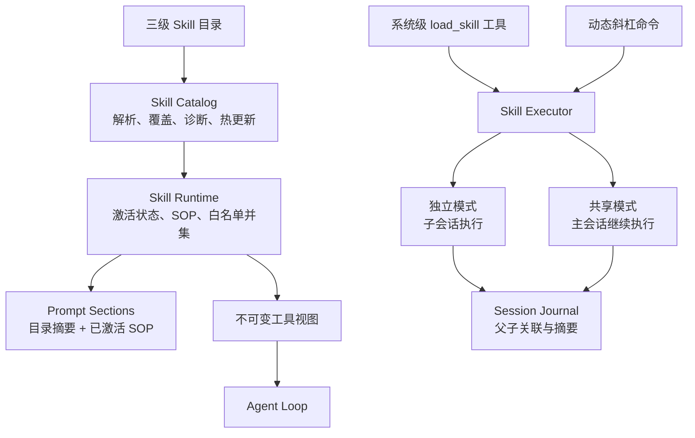
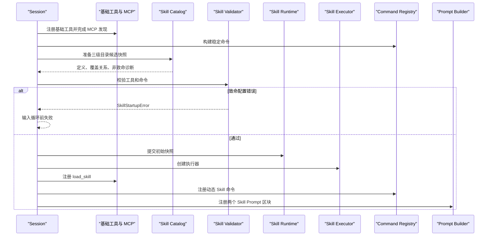
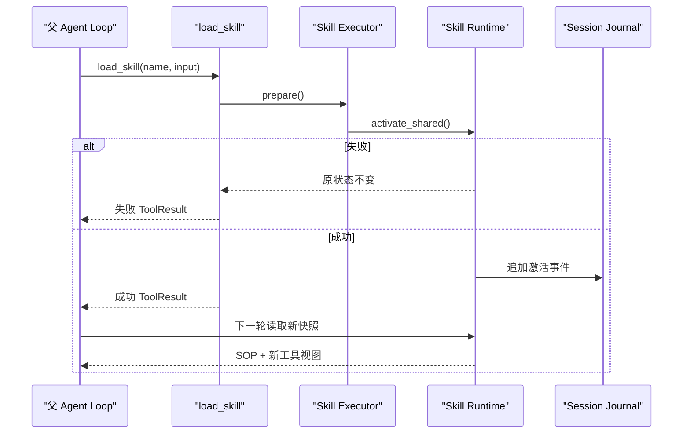
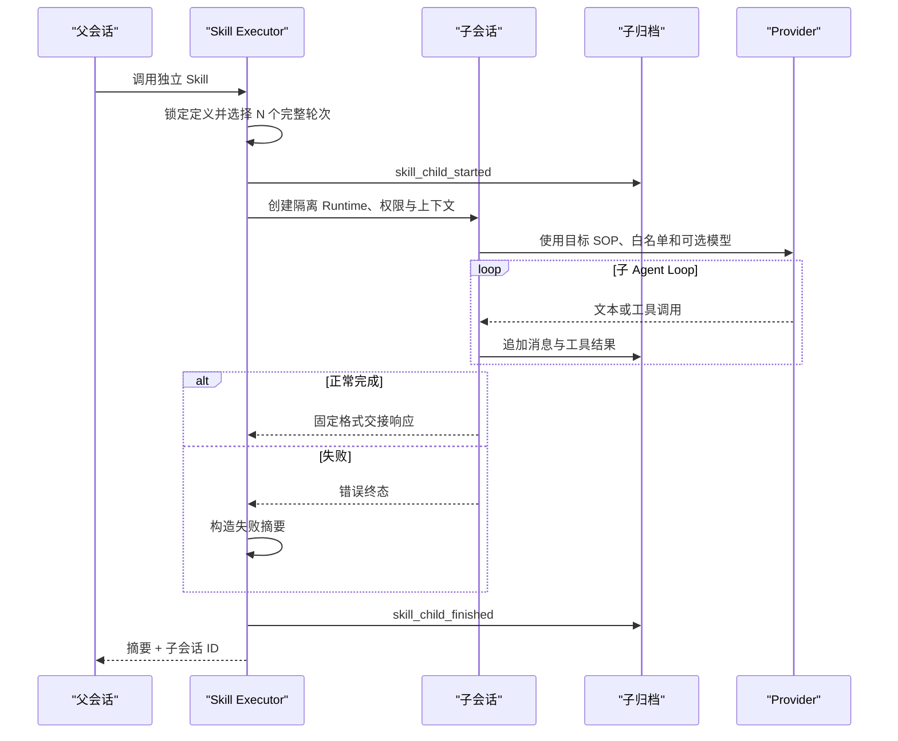

# FlickCode Skill 系统 Plan

## 架构概览

采用“目录快照 → 会话运行时 → 执行器”的三层核心架构，并通过适配层接入现有 Prompt、Agent Loop、命令和归档系统。



### Skill Catalog

负责三级目录发现、Markdown/frontmatter 解析、目录型工具声明解析、同名覆盖、冲突诊断和内容指纹。Catalog 刷新先构造候选快照，只有完整校验通过后才提交，不执行任何 Skill 脚本。

### Skill Runtime

每个主会话拥有一个 Runtime，统一维护当前有效 Catalog、共享 Skill 的有序激活记录、`{{input}}` 渲染结果、热更新协调和工具白名单并集。Prompt、Agent Loop、命令和状态诊断只从 Runtime 读取 Skill 状态。

### 工具访问层

基础、MCP 和 Skill 工具保留在主工具池中，每轮模型请求只获得一个不可变 `ToolRegistryView`。Provider schema、未知工具判断和实际执行共用该视图，因此隐藏工具即使被猜中也不能执行。`load_skill` 始终加入视图，计划模式限制继续叠加。

### Prompt 接入

新增 Skill Catalog 与 Active Skills 两个固定区块。前者只展示有效 Skill 名称和一句说明，后者展示当前共享 Skill 的完整渲染 SOP。Active Skills 位于通用内置指导之前。

### Skill Executor

加载工具和动态斜杠命令统一进入 Executor。共享模式原子激活后继续主 Agent Loop；独立模式截取指定数量的完整父轮次，创建隔离子会话，运行后只回流摘要。

### 命令接入

命令 registry 分为稳定内置区和动态 Skill 区。输入路由和补全前执行惰性刷新，再原子替换动态区。硬编码 `/review` 被移除，由内置 `review` Skill 提供；`/reset` 属于稳定命令。

### 会话与归档

主归档增加 Skill 激活、更新、停用和重置事件。独立执行使用单独子归档并记录父会话、Skill、来源和终态。恢复只读取激活声明，再以当前 Catalog 重建状态，不执行归档 SOP 或脚本。

## 核心数据结构

### Skill 定义

```python
class SkillMode(str, Enum):
    SHARED = "shared"
    ISOLATED = "isolated"


class SkillSource(str, Enum):
    BUILTIN = "builtin"
    USER = "user"
    PROJECT = "project"


@dataclass(frozen=True)
class SkillToolDefinition:
    name: str
    description: str
    input_schema: Dict[str, Any]
    entrypoint: Path
    package_root: Path
    script_source: str
    fingerprint: str


@dataclass(frozen=True)
class SkillDefinition:
    name: str
    description: str
    tool_names: Tuple[str, ...]
    mode: SkillMode
    history: Optional[int]
    model: Optional[str]
    instructions: str
    source: SkillSource
    entry_path: Path
    package_root: Optional[Path]
    custom_tools: Tuple[SkillToolDefinition, ...]
    fingerprint: str

    def render(self, user_input: str) -> str: ...
```

`SkillDefinition` 不可变。有效更新创建新对象，已经开始的执行继续使用旧对象。

目录型工具由 `tools/*.json` 声明：

```json
{
  "name": "example_tool",
  "description": "一句工具说明",
  "input_schema": {
    "type": "object",
    "properties": {},
    "required": []
  },
  "entrypoint": "scripts/example_tool.py"
}
```

入口限于能力包内的 Python 脚本，工具名以 `name` 字段为准。Parser 在构建快照时读取并保存脚本文本；入口路径只作为来源和路径安全信息。

### Catalog 候选与快照

```python
@dataclass(frozen=True)
class SkillDiagnostic:
    severity: str
    phase: str
    message: str
    path: Optional[Path]
    skill_name: Optional[str]


@dataclass(frozen=True)
class SkillCatalogSnapshot:
    generation: int
    effective: Mapping[str, SkillDefinition]
    shadowed: Mapping[str, Tuple[SkillDefinition, ...]]
    diagnostics: Tuple[SkillDiagnostic, ...]
    source_signatures: Mapping[Path, str]


@dataclass(frozen=True)
class SkillCatalogCandidate:
    previous: SkillCatalogSnapshot
    current: SkillCatalogSnapshot
    added: Tuple[str, ...]
    changed: Tuple[str, ...]
    removed: Tuple[str, ...]
    retained_invalid: Tuple[str, ...]


class SkillCatalog:
    def prepare_refresh(self) -> SkillCatalogCandidate: ...
    def commit(self, candidate: SkillCatalogCandidate) -> None: ...
    def snapshot(self) -> SkillCatalogSnapshot: ...
    def resolve(self, name: str) -> Optional[SkillDefinition]: ...
```

`prepare_refresh()` 只构造候选。Runtime 与动态命令也准备成功后，Session 才提交三者。

### 激活状态

```python
@dataclass(frozen=True)
class ActiveSkill:
    definition: SkillDefinition
    user_input: str
    rendered_instructions: str
    activation_order: int


@dataclass(frozen=True)
class ActivationResult:
    success: bool
    active_skill: Optional[ActiveSkill]
    diagnostics: Tuple[SkillDiagnostic, ...]
    changed_tool_names: Tuple[str, ...]


@dataclass(frozen=True)
class SkillRuntimeSnapshot:
    catalog: SkillCatalogSnapshot
    active_skills: Tuple[ActiveSkill, ...]
    allowed_tool_names: FrozenSet[str]
    diagnostics: Tuple[SkillDiagnostic, ...]


@dataclass(frozen=True)
class SkillRuntimeCandidate:
    catalog: SkillCatalogSnapshot
    active_skills: Tuple[ActiveSkill, ...]
    allowed_tool_names: FrozenSet[str]
    custom_tool_instances: Tuple[BaseTool, ...]
    diagnostics: Tuple[SkillDiagnostic, ...]


class SkillRuntime:
    def prepare_reconcile(
        self,
        candidate: SkillCatalogCandidate,
    ) -> "SkillRuntimeCandidate": ...
    def commit(self, candidate: "SkillRuntimeCandidate") -> None: ...
    def activate_shared(self, name: str, user_input: str) -> ActivationResult: ...
    def reset(self) -> None: ...
    def restore(self, activations: Sequence["ArchivedSkillActivation"]) -> None: ...
    def snapshot(self) -> SkillRuntimeSnapshot: ...
    def prompt_context(self) -> Dict[str, Any]: ...
    def tool_view(self, mode: AgentMode) -> "ToolRegistryView": ...
```

重复激活保留首次 `activation_order`。Runtime 先构造候选激活状态、专属适配器和工具视图，全部成功后再替换当前状态。

热更新协调规则：

- 有效修改替换定义和渲染结果。
- 原激活来源仍存在但暂时解析失败时保留最后有效对象。
- 原来源删除时切换有效回退定义；无回退则停用。
- 共享 Skill 被改为独立模式时停用并报告。
- 新定义产生未知工具或冲突时拒绝整个运行时刷新。

### 不可变工具视图

```python
class ToolRegistryView:
    def get(self, name: str) -> Optional[BaseTool]: ...
    def list_tools(self) -> List[str]: ...
    def to_api_tools(self, api_format: str) -> List[Dict[str, Any]]: ...


class ToolRegistry:
    def snapshot(
        self,
        names: Set[str],
        extras: Iterable[BaseTool] = (),
    ) -> ToolRegistryView: ...


ToolViewProvider = Callable[[AgentMode], ToolRegistryView]
```

`AgentLoop` 增加可选 `tool_view_provider`。每轮开始获取一次视图，并将其传给 schema 转换、上下文估算、未知工具校验和该轮全部工具执行。

### 专属脚本工具

```python
class SkillScriptTool(BaseTool):
    def __init__(self, definition: SkillToolDefinition): ...
    def execute(self, arguments: Dict[str, Any]) -> ToolResult: ...
```

适配器使用当前 Python 解释器执行定义快照中保存的脚本文本，而不是在调用时重新读取入口路径。脚本通过标准输入接收 JSON 参数，通过标准输出返回：

```json
{
  "success": true,
  "output": "结果文本",
  "error": ""
}
```

非零退出、超时、非法 JSON 和路径越界都转换为失败 `ToolResult`。适配器创建和 Skill 激活不导入或执行脚本。本阶段入口脚本不得依赖 `__file__`、同包相对导入或未声明的伴随资源。

### 调用与执行结果

```python
class SkillInvocationOrigin(str, Enum):
    TOOL = "tool"
    SLASH = "slash"


@dataclass(frozen=True)
class SkillInvocation:
    definition: SkillDefinition
    user_input: str
    origin: SkillInvocationOrigin
    parent_session_id: str
    parent_agent_mode: AgentMode


@dataclass(frozen=True)
class SkillExecutionResult:
    success: bool
    mode: SkillMode
    summary: str
    child_session_id: Optional[str]
    diagnostics: Tuple[SkillDiagnostic, ...]


class SkillExecutor:
    def prepare(
        self,
        name: str,
        user_input: str,
        origin: SkillInvocationOrigin,
        parent_mode: AgentMode,
    ) -> SkillInvocation: ...
    def activate_shared(self, invocation: SkillInvocation) -> SkillExecutionResult: ...
    def run_isolated(self, invocation: SkillInvocation) -> SkillExecutionResult: ...


class LoadSkillTool(BaseTool):
    # input: {"name": str, "input": str}
    def execute(self, arguments: Dict[str, Any]) -> ToolResult: ...
```

共享加载返回激活确认；独立加载同步运行子会话并将摘要作为工具结果。

### 完整轮次与子会话

```python
class ConversationTurnSelector:
    def last_complete_turns(
        self,
        messages: Sequence[Message],
        count: int,
    ) -> List[Message]: ...


@dataclass(frozen=True)
class ChildSessionMetadata:
    child_session_id: str
    parent_session_id: str
    skill_name: str
    skill_source: SkillSource
    model: str
    status: str


@dataclass(frozen=True)
class ArchivedSkillActivation:
    name: str
    user_input: str
    recorded_source: str
```

轮次选择器以用户消息为边界，保留 user/assistant/tool 协议链，不从工具调用中间截断。子会话的最终交接响应作为摘要；Provider 未产生最终响应时由 Executor 构造确定性失败摘要。

## 模块设计

### `flickcode.skills.models`

**职责：** 定义 Skill、工具声明、Catalog、激活、调用结果和诊断模型。

**依赖：** 标准库及仅用于类型提示的 `Message`。不扫描文件、不请求 Provider、不执行脚本。

### `flickcode.skills.parser`

**职责：**

- 解析严格 YAML frontmatter 与 Markdown 正文。
- 解析单文件和目录型能力包。
- 校验字段组合、工具 schema、入口文件和路径边界。
- 计算正文、schema 和入口内容指纹。
- 不导入或执行脚本。

**接口：**

```python
class SkillParser:
    def parse_file(self, path: Path, source: SkillSource) -> SkillDefinition: ...
    def parse_package(self, root: Path, source: SkillSource) -> SkillDefinition: ...
```

**依赖：** PyYAML、标准库、`skills.models`。

### `flickcode.skills.catalog`

**职责：** 扫描三个固定根目录的直属条目、缓存签名、检测同级重名、按优先级覆盖并准备不可变候选快照。

**依赖：** `skills.parser`、`skills.models`。不依赖 Session、Provider、命令或工具 registry。

### `flickcode.skills.validation`

**职责：**

- 校验基础/MCP 工具存在性。
- 限制专属工具只由所属 Skill 引用。
- 检测专属工具重名和稳定命令冲突。
- 区分启动致命错误与运行时拒绝更新。

**接口：**

```python
class SkillStartupError(RuntimeError): ...

class SkillValidator:
    def validate_startup(...) -> None: ...
    def validate_refresh(...) -> Tuple[SkillDiagnostic, ...]: ...
```

### `flickcode.skills.runtime`

**职责：** 持有有效 Catalog 和有序激活状态，完成渲染、白名单并集、专属适配器创建、热更新协调、重置、恢复以及 Prompt/工具视图输出。

**依赖：** Catalog、Validator、Script Tool 和 Tool Registry；不导入 Session 或命令模块。

### `flickcode.skills.history`

**职责：** 从父历史选择最近 N 个协议完整轮次，省略 system 与内部 thinking 消息。

### `flickcode.skills.script_tool`

**职责：** 将一个专属工具定义适配为 `BaseTool`，使用无 shell 的 JSON 子进程协议执行快照中的脚本文本，处理超时和脱敏错误。

### `flickcode.skills.ports`

通过 Protocol 描述 Executor 所需父会话能力，防止 Executor 反向导入 Session：

```python
class SkillExecutionHost(Protocol):
    active_session_id: str
    messages: Sequence[Message]
    provider_config: ProviderConfig
    agent_config: AgentConfig

    def create_tool_view(...): ...
    def append_skill_summary(...): ...
    def record_skill_event(...): ...
    def create_child_context(...): ...
```

### `flickcode.skills.executor`

**职责：**

- 统一准备加载工具和斜杠调用。
- 共享模式调用 Runtime 原子激活。
- 独立模式选择历史、复制 Provider 配置并替换可选模型。
- 创建隔离 Context Manager、Permission Engine、Runtime 和子归档。
- 运行子 Agent Loop并生成正常或失败摘要。

**依赖：** `SkillExecutionHost`，不依赖具体 `Session` 类。

### `flickcode.skills.load_tool`

定义系统级 `load_skill` schema，调用 Executor，并将结果转换为 `ToolResult`。Session 构造 Executor 后再创建此工具。

### `flickcode.skills.commands`

根据 Catalog 构造动态 `CommandSpec`，通过 `CommandUI.run_skill()` 调用 Session，并为动态 registry 准备整区替换候选。模块本身不执行 Skill。

```python
class SkillCommandManager:
    def prepare(
        self,
        snapshot: SkillCatalogSnapshot,
    ) -> Tuple[CommandSpec, ...]: ...

    def commit(self, specs: Tuple[CommandSpec, ...]) -> None: ...
```

### Prompt 集成

在 `flickcode.prompt.sections` 增加：

```python
class ActiveSkillsSection(PromptSection):  # priority = 3
    ...

class SkillCatalogSection(PromptSection):  # priority = 4
    ...
```

Prompt 顺序：

```text
项目指令
用户指令
已激活 Skill 完整 SOP
Skill 名称与说明目录
通用内置指导
项目/用户记忆
```

Prompt 模块只渲染 Runtime 放入上下文的数据。

### 工具与 Agent Loop 集成

`flickcode.tools.registry` 增加 `ToolRegistryView` 和快照创建能力。`AgentLoop` 每轮获取一次视图；计划模式与只读集合取交集后重新加入 `load_skill`。工具批次执行期间不读取新 Runtime。

### 命令与 TUI 集成

`CommandRegistry` 区分稳定和动态区并增加 `replace_dynamic()`。`builtin.py` 删除硬编码 `review`、增加 `reset`，并保留 `audit` 兼容入口委托当前有效 `review` Skill。

`CommandUI` 增加：

```python
def run_skill(self, name: str, user_input: str, mode: AgentMode) -> None: ...
```

Input Router 在解析前调用刷新钩子，Command Completer 在生成候选前调用同一入口。TUI 与 Pipe 使用 Session 持有的统一命令 registry。

### Session 集成

Session 是组合根，按以下顺序装配：

1. 创建基础工具 registry。
2. 完成 MCP 发现。
3. 创建稳定命令 registry。
4. 准备 Catalog 并做启动校验。
5. 创建 Runtime 与 Executor。
6. 注册 `load_skill`。
7. 注册动态 Skill 命令。
8. 创建带 Skill 区块的 Prompt Builder。

新增接口：

```python
def refresh_skills(self) -> SkillCatalogCandidate: ...
def invoke_skill(...) -> Generator[AgentEvent, None, None]: ...
def reset(self) -> None: ...
def skill_status_snapshot(self) -> SkillRuntimeSnapshot: ...
```

`Session.agent_chat()` 使用动态工具视图。`Session.chat()` 保持 `StreamEvent` 对外类型，但内部适配统一 Agent Loop，消除第二套工具执行路径。

### 归档与恢复

`SessionJournal` 增加类型化 Skill 事件。主会话保留在 `sessions/*.jsonl`，子会话放在 `sessions/children/*.jsonl`，不会出现在普通会话列表。

归档事件：

```text
skill_activated
skill_rebound
skill_deactivated
skill_child_started
skill_child_finished
session_reset
```

Recovery 在修复消息协议链的同时重放 Skill 状态事件，忽略未知未来事件并记录诊断。Runtime 使用当前 Catalog 重新解析恢复结果。

### 内置资源

内置目录包含 `commit.md`、`test.md` 和目录型 `review/`。`review_project_snapshot` 专属工具只统计项目文件类型、数量和大小，不修改文件、不访问网络、不依赖 Git。所有样板走普通 Parser、Catalog 和 Validator。

## 模块交互

### 启动



### 共享斜杠调用

1. Input Router 调用 `Session.refresh_skills()`。
2. 动态 registry 解析 Skill 命令并保留原始参数。
3. Command UI 调用 `Session.invoke_skill()`。
4. Executor 锁定定义，Runtime 准备渲染、专属适配器和工具视图。
5. 全部成功后提交激活状态并追加激活或重绑事件。
6. Session 将原始参数作为用户消息交给 `agent_chat()`。
7. Agent Loop 第一轮读取完整 SOP 和新工具视图。
8. 全部响应和工具记录进入主历史。

### Agent 加载共享 Skill



同一批并列工具调用不能使用刚加载的工具。

### 独立执行



子会话只复制完整 user/assistant/tool 轮次，不复制父系统 Prompt；使用当前项目/用户指令和记忆，Active Skills 只含目标 Skill。它复制父 Provider 配置并仅替换模型，创建独立 Context Manager 与 Permission Engine，不触发长期记忆更新。

加载工具来源的摘要作为 ToolResult 返回；斜杠来源在父归档追加规范化调用记录与助手摘要，不额外调用父模型。

### 惰性热更新事务

```python
catalog_candidate = catalog.prepare_refresh()
runtime_candidate = runtime.prepare_reconcile(catalog_candidate)
command_candidate = command_manager.prepare(catalog_candidate.current)

catalog.commit(catalog_candidate)
runtime.commit(runtime_candidate)
command_manager.commit(command_candidate)
```

三部分均通过才提交。已激活来源暂时无效时保留最后有效对象；删除时切换回退或停用。未知工具、重名或命令冲突拒绝整次刷新。运行中的调用继续持有旧定义和旧工具视图。

### 恢复

1. Recovery 读取并修复消息协议链。
2. 重放 Skill 激活、重绑、停用和重置事件。
3. 刷新 Catalog。
4. Runtime 按当前定义重建激活候选；缺失定义只记录并跳过。
5. 使用候选 Prompt 与工具视图检查上下文预算。
6. 全部通过后一次替换消息、Context Manager、Session ID、计划上下文和激活状态。
7. 追加 resumed 事件。

准备阶段失败时保留恢复前状态。

### `/reset`

1. 当前归档追加 `session_reset`。
2. Runtime 清空激活状态，工具视图恢复默认集合。
3. 清空主历史和计划上下文。
4. 创建新 Context Manager 和主 Session ID。
5. UI 模式切回 `[DEFAULT]`。
6. 保留 Catalog 和动态 Skill 命令。

`/clear` 继续只清屏。

## 文件组织

```text
Flick Code/
├── docs/skills/
│   ├── spec.md
│   ├── plan.md
│   ├── task.md
│   └── checklist.md
├── src/flickcode/
│   ├── skills/
│   │   ├── __init__.py
│   │   ├── models.py
│   │   ├── parser.py
│   │   ├── catalog.py
│   │   ├── validation.py
│   │   ├── runtime.py
│   │   ├── history.py
│   │   ├── ports.py
│   │   ├── executor.py
│   │   ├── script_tool.py
│   │   ├── load_tool.py
│   │   ├── commands.py
│   │   └── builtins/
│   │       ├── commit.md
│   │       ├── test.md
│   │       └── review/
│   │           ├── SKILL.md
│   │           ├── tools/project_snapshot.json
│   │           └── scripts/project_snapshot.py
│   ├── agent.py
│   ├── session.py
│   ├── tui.py
│   ├── tools/
│   │   ├── __init__.py
│   │   └── registry.py
│   ├── prompt/
│   │   ├── __init__.py
│   │   └── sections.py
│   ├── commands/
│   │   ├── adapters.py
│   │   ├── builtin.py
│   │   ├── dispatcher.py
│   │   └── registry.py
│   └── sessions/
│       ├── __init__.py
│       ├── journal.py
│       └── recovery.py
├── tests/
│   ├── fixtures/skills/
│   ├── test_skills_parser.py
│   ├── test_skills_catalog.py
│   ├── test_skills_validation.py
│   ├── test_skills_runtime.py
│   ├── test_skills_history.py
│   ├── test_skills_script_tool.py
│   ├── test_skills_executor.py
│   ├── test_skills_commands.py
│   ├── test_skills_sessions.py
│   └── test_skills_integration.py
├── pyproject.toml
└── README.md
```

### 现有文件改动

| 文件 | 改动 |
|---|---|
| `src/flickcode/agent.py` | 每轮获取一次工具视图，并用同一视图处理 schema、未知工具和执行。 |
| `src/flickcode/session.py` | 装配 Skill 组件，提供刷新、调用、恢复和 reset。 |
| `src/flickcode/tui.py` | TUI/Pipe 共用 Session 命令 registry；输入与补全前刷新。 |
| `src/flickcode/tools/registry.py` | 增加不可变工具视图和快照能力。 |
| `src/flickcode/prompt/sections.py` | 增加 Catalog 与 Active Skills 区块。 |
| `src/flickcode/commands/registry.py` | 稳定区与动态区原子替换。 |
| `src/flickcode/commands/builtin.py` | 删除 review，增加 reset 和 audit 兼容入口。 |
| `src/flickcode/commands/adapters.py` | 增加 `run_skill()`。 |
| `src/flickcode/commands/dispatcher.py` | 增加输入前刷新钩子。 |
| `src/flickcode/sessions/journal.py` | 增加 Skill 事件和 children 归档。 |
| `src/flickcode/sessions/recovery.py` | 重放激活声明并保持现有消息修复。 |
| `pyproject.toml` | 将内置 Markdown、JSON 和脚本资源打入 wheel。 |
| `README.md` | 记录格式、目录、模式、白名单、热更新和 reset。 |

不增加配置字段，不改变 Provider 对外接口，不增加第三方依赖，不修改记忆格式。

## 技术决策

| 决策点 | 选择 | 理由 |
|---|---|---|
| frontmatter | 严格字段；共享禁止 `history/model`，独立必须有 `history` | 尽早发现拼写和组合错误。 |
| YAML | `yaml.safe_load` | 复用已有依赖且不执行自定义类型。 |
| 路径 | 固定三级目录 | 行为确定且不扩大范围。 |
| 指纹 | 元数据快速筛选 + SHA-256 最终身份 | 兼顾性能和可靠性。 |
| 更新 | prepare/validate/commit | 避免跨组件部分更新。 |
| 工具视图 | 每轮不可变快照 | schema 与执行一致。 |
| 白名单顺序 | Skill 并集 → Agent 模式 → 加回 `load_skill` | 同时满足组合、只读和系统加载。 |
| 加载权限 | `load_skill` 由内置只读规则允许 | 加载不执行专属脚本。 |
| 专属工具 | JSON schema + Python 脚本 | 可静态解析且无需 import。 |
| 脚本协议 | 快照保存脚本文本；JSON stdin/stdout；`python -c`；无 shell | 避免 shell 注入和路径读取时序竞争，保证执行使用不可变快照。 |
| 脚本限制 | 60 秒、最小环境、项目工作目录 | 防挂起并减少敏感环境继承。 |
| 工具冲突 | 与基础、MCP、其他 Skill 重名均致命 | 名称全局无歧义。 |
| 共享模型 | 使用主模型 | 避免多个激活 Skill 冲突。 |
| 独立模型 | 克隆父 Provider，只替换模型名 | 不新增协议和凭据配置。 |
| 子历史 | 保留完整 user/assistant/tool，省略 system/thinking | 协议完整且不复制旧系统与内部推理。 |
| 摘要 | 最终交接直接回流，失败本地构造，最多 8192 字符 | 不增加摘要模型请求并限制主上下文。 |
| 子归档 | `sessions/children/*.jsonl` | 与普通恢复列表隔离。 |
| 动态命令 | 稳定区 + 动态区整区替换 | 帮助、解析、补全同代。 |
| review | Skill 接管 `/review`，`/audit` 委托兼容 | 满足新语义并保留兼容入口。 |
| reset | 先归档再清状态 | 操作可恢复。 |
| chat API | 适配到统一 Agent Loop | 消除白名单语义分叉。 |
| 并发 | 无 watcher，请求边界串行提交 | 符合惰性热更新且减少竞争。 |
| 内置样板 | 走普通解析与校验 | 无隐藏特例。 |
| 兼容性 | 无新依赖，新增代码使用 Python 3.8 兼容语法 | 满足项目声明。 |

## 错误分类

| 类别 | 示例 | 行为 |
|---|---|---|
| 非致命定义错误 | YAML、字段、入口错误 | 跳过单个定义并允许低级回退。 |
| 启动致命错误 | 未知工具、工具重名、命令冲突 | 输入循环前失败。 |
| 运行时刷新拒绝 | 热更新产生未知工具或动态冲突 | 保留当前三份快照。 |
| 调用错误 | Skill 不存在、模型创建失败 | 不改变父状态，返回命令或工具错误。 |
| 子执行错误 | Provider、权限、超时、最大轮次 | 写子终态并回流失败摘要。 |
| 脚本错误 | 退出、超时、非法 JSON、越界 | 返回失败 ToolResult。 |
| 归档错误 | 写失败、坏行、未知事件 | 内存继续，恢复时跳过并报告。 |

## Spec 覆盖关系

| Spec | 主要设计归属 |
|---|---|
| F1 | Models、Parser |
| F2 | Parser、Script Tool |
| F3 | Catalog |
| F4 | Validator、Catalog Prompt、Load Tool |
| F5 | Runtime、Executor、Load Tool |
| F6 | Runtime、Active Skills Prompt |
| F7 | Tool Registry View、Runtime、Agent Loop |
| F8 | Executor、Session、主 Journal |
| F9 | History、Executor、子 Journal |
| F10 | Skill Commands、Command Registry、TUI/Pipe |
| F11 | Catalog Candidate、Runtime、动态命令事务 |
| F12 | Session、Journal、Recovery、Reset |
| F13 | Diagnostics、Validator、Executor、Script Tool |
| F14 | Builtins、wheel 资源配置 |
| N1–N3 | 不可变快照、稳定排序、两阶段提交 |
| N4–N5 | 路径约束、无 shell、权限链、父子隔离 |
| N6 | 统一 Agent Loop、Provider schema、TUI/Pipe |
| N7 | Runtime Snapshot、Session 状态、归档元数据 |
| N8 | Protocol、假 Provider、临时目录、模块边界 |
| N9 | Catalog、Runtime、Executor 分层 |

## 设计自检

- F1–F14 均有明确模块和调用路径。
- Provider schema 与实际工具执行使用同一不可变视图。
- Catalog、Runtime 和动态命令不会跨代部分更新。
- Session 是唯一组合根，Skill 子模块不反向导入它。
- 共享和独立模式共用解析、验证和调用准备。
- 恢复只重放声明，不执行归档代码。
- 没有引入市场、版本、远程分发或命名参数。
- 文件组织、类型和接口在全文保持一致。
