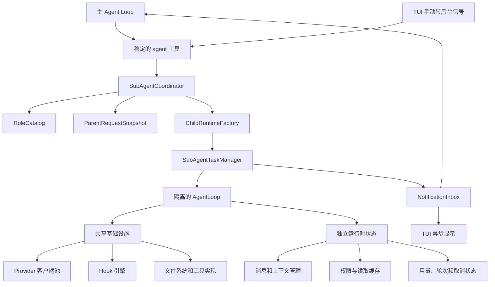
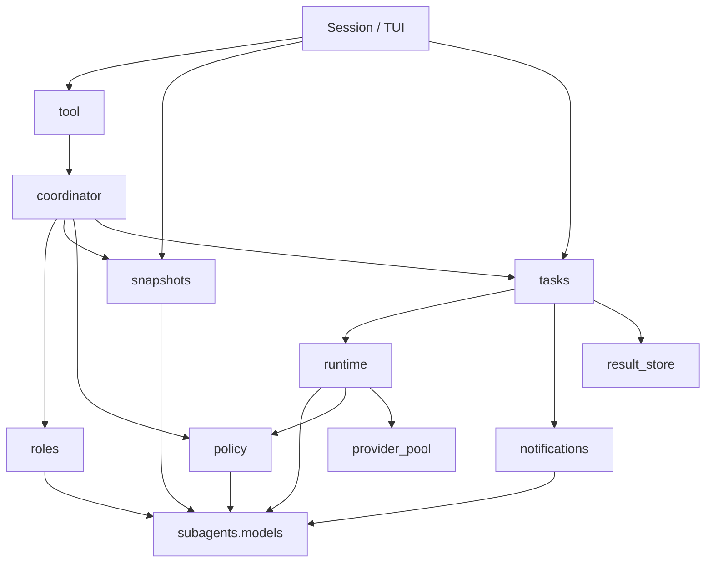

# FlickCode 子 Agent 委派 Plan

## 架构概览

采用独立的 `flickcode.subagents` 包。定义式和 Fork 式只在启动快照构造阶段分流，之后统一进入任务管理、隔离运行、状态记录和通知管线。



### AgentTool

只注册一个名为 `agent` 的工具，固定支持以下操作：

- `start`：通过 `type=defined|fork` 启动任务；
- `status`：查询任务状态和用量；
- `result`：按任务 ID 读取完整结果；
- `cancel`：请求取消任务。

`start` 接受任务描述、可选角色和后台标记。条件字段由运行时校验，角色列表不写入动态枚举，因此角色刷新不会改变工具 schema。

### RoleCatalog

负责解析角色 Markdown、校验 frontmatter、生成不可变快照，并按以下顺序解决覆盖：

`project → user → builtin → plugin`

默认目录设计为：

- 项目：`.flickcode/agents/`
- 用户：`~/.flickcode/agents/`
- 内置：`src/flickcode/subagents/builtins/`
- 插件：由 `SubAgentConfig.plugin_role_dirs` 注入的一个或多个 `agents/` 目录

当前仓库没有插件管理器，因此目录注入是本阶段的插件边界；未来插件系统只需向目录列表追加来源，不改变角色目录或调用方。

### SubAgentCoordinator

作为统一编排入口，负责：

- 校验工具参数；
- 解析角色与模型别名；
- 获取父请求快照；
- 计算最终工具集和权限模式；
- 构造定义式或 Fork 式启动请求；
- 将任务提交给任务管理器；
- 前台等待、超时自动转后台或响应手动转后台。

它不直接运行模型，也不保存可变任务状态。

### ParentRequestSnapshot

主 `AgentLoop` 在每次 Provider 请求前记录不可变快照，包括：

- 已完成消息前缀；
- 实际 system prompt；
- 当前 Agent 模式；
- 实际工具视图及顺序；
- Provider 与模型配置；
- 当前会话和轮次身份。

Fork 使用最近一次请求快照，而不是重新从可变的 `Session.messages` 拼装历史。这能避免复制半成品消息，并最大限度保持首次请求的缓存前缀稳定。

### ChildRuntimeFactory 与 SubAgentRunner

`ChildRuntimeFactory` 为每个任务创建独立的消息列表、`ContextManager`、`PermissionEngine`、用量累计器、取消令牌和只读工具视图。

`SubAgentRunner` 复用现有 `AgentLoop` 执行“跑到底”流程。为此会给 `AgentLoop` 增加：

- 每轮及工具批次之间的取消检查；
- 请求快照回调；
- 缓存创建和缓存读取 Token 的累计；
- 子 Agent 生命周期元数据。

定义式使用角色正文构造固定 system prompt；Fork 首轮直接复用父请求快照中的 system prompt 和消息前缀。

### SubAgentTaskManager

所有子 Agent——包括表面上的前台任务——都先提交到有界工作池。前台只是调用方暂时等待同一个任务，而不是另一条执行路径。

因此三种转后台方式都不会重启任务：

- 显式后台：提交后立即返回任务 ID；
- 自动后台：等待超过配置阈值后返回同一任务 ID；
- 手动后台：TUI 通过 `ForegroundControl` 发出脱离信号，等待方立即返回同一任务 ID；
- Fork：提交后强制直接返回任务 ID。

管理器持有内存任务存储和严格状态机，并负责容量限制、取消、关闭和结果截断或外置。

### NotificationInbox

任务结束回调只写入线程安全的通知收件箱，不直接修改父消息列表。

父会话在安全边界排空通知：

- TUI 立即显示简短完成通知；
- 主 Agent 下一次 Provider 请求前，追加一次结构化摘要消息；
- 完整结果只通过 `agent(result)` 查询；
- 任务记录中的 `notified` 标记保证回调幂等。

### Session、TUI 与 Hook 集成

`Session` 负责组装角色目录、任务管理器、协调器和 `agent` 工具，并在关闭时有界停止任务。

TUI 增加前台子 Agent 的手动转后台控制和后台完成提示。非交互管道模式不监听快捷键，但仍支持显式后台与自动后台。

Hook 继续使用现有引擎，但事件上下文增加可选的 Agent 元数据；普通父 Agent 的现有事件 schema 和行为保持兼容。

## 核心数据结构

### 角色模型

```python
class AgentRoleSource(Enum):
    PROJECT = "project"
    USER = "user"
    BUILTIN = "builtin"
    PLUGIN = "plugin"


class AgentModelAlias(Enum):
    INHERIT = "inherit"
    HAIKU = "haiku"
    SONNET = "sonnet"
    OPUS = "opus"


class AgentPermissionMode(Enum):
    INHERIT = "inherit"
    STRICT = "strict"
    DEFAULT = "default"
    PERMISSIVE = "permissive"


@dataclass(frozen=True)
class AgentRoleDefinition:
    name: str
    description: str
    allowed_tools: frozenset[str]
    denied_tools: frozenset[str]
    model: AgentModelAlias
    max_turns: int
    permission_mode: AgentPermissionMode
    system_prompt: str
    source: AgentRoleSource
    source_path: Path
    fingerprint: str
```

角色 frontmatter 固定为：

```yaml
---
name: code-reviewer
description: Review code and report actionable findings.
tools:
  allow: [read_file, glob, grep]
  deny: [write_file, edit_file, execute_command]
model: inherit
max_turns: 20
permission_mode: strict
---
```

`tools.allow` 和 `tools.deny` 都是必填列表；冲突项最终进入 deny。正文非空，作为 `system_prompt`。

```python
@dataclass(frozen=True)
class AgentRoleCatalogSnapshot:
    generation: int
    effective: Mapping[str, AgentRoleDefinition]
    shadowed: Mapping[str, tuple[AgentRoleDefinition, ...]]
    diagnostics: tuple[AgentRoleDiagnostic, ...]


class AgentRoleParser:
    def parse_file(path, source) -> AgentRoleDefinition: ...


class AgentRoleCatalog:
    def prepare_refresh() -> AgentRoleCatalogCandidate: ...
    def commit(candidate) -> AgentRoleCatalogSnapshot: ...
    def resolve(name) -> AgentRoleDefinition | None: ...
```

沿用 Skill 目录的“准备—校验—提交”刷新模式，避免刷新失败破坏上一份有效快照。

### 子 Agent 配置

```python
@dataclass(frozen=True)
class SubAgentConfig:
    max_workers: int = 4
    max_pending: int = 16
    foreground_timeout_seconds: float = 30.0
    shutdown_timeout_seconds: float = 5.0
    result_inline_chars: int = 16_384
    result_max_chars: int = 1_000_000
    background_allowed_tools: frozenset[str] = frozenset()
    additional_denied_tools: frozenset[str] = frozenset()
    plugin_role_dirs: tuple[Path, ...] = ()
    model_aliases: Mapping[AgentModelAlias, str] = field(default_factory=dict)
```

不可覆盖的委派禁止集固定包含 `agent` 与 `load_skill`；`additional_denied_tools` 只能继续收紧，不能移除固定项。

`model_aliases` 的值是现有 Provider 配置名，而不是易过期的模型字符串，例如：

```yaml
subagents:
  model_aliases:
    haiku: claude-haiku
    sonnet: claude-sonnet
    opus: claude-opus
```

对应 Provider 条目决定协议、连接信息和具体模型。`inherit` 直接复用父 Provider 配置。别名未配置时，调用该角色会返回明确错误，不猜测具体模型版本。

### 工具请求与返回

```python
class AgentToolOperation(Enum):
    START = "start"
    STATUS = "status"
    RESULT = "result"
    CANCEL = "cancel"


class AgentInvocationType(Enum):
    DEFINED = "defined"
    FORK = "fork"


@dataclass(frozen=True)
class AgentToolRequest:
    operation: AgentToolOperation
    type: AgentInvocationType | None
    task: str | None
    role: str | None
    background: bool | None
    task_id: str | None
```

条件规则：

- `start + defined`：要求 `task`、`role`；
- `start + fork`：要求 `task`，禁止 `role`，并强制后台；
- `status/result/cancel`：只要求 `task_id`；
- 其他字段组合一律返回校验错误。

统一返回 JSON：

```python
@dataclass(frozen=True)
class AgentToolResponse:
    success: bool
    task_id: str | None
    status: str | None
    background: bool
    forced_background: bool
    summary: str
    usage: AgentUsage | None
    error: str | None
```

### 父请求快照与启动规格

```python
@dataclass(frozen=True)
class ParentRequestSnapshot:
    session_id: str
    turn_number: int
    mode: AgentMode
    messages: tuple[Message, ...]
    system_prompt: str | None
    tool_view: ToolRegistryView
    provider_config: ProviderConfig
    thinking: bool


@dataclass(frozen=True)
class SubAgentLaunchSpec:
    task_id: str
    parent_session_id: str
    invocation_type: AgentInvocationType
    role: AgentRoleDefinition | None
    task: str
    messages: tuple[Message, ...]
    system_prompt: str
    mode: AgentMode
    provider_config: ProviderConfig
    tool_view: ToolRegistryView
    permission_mode: PermissionMode
    max_turns: int
    thinking: bool
    forced_background: bool
```

快照中的消息必须深复制，工具视图不可变。它记录的是实际发送给 Provider 的稳定历史，不包含 transient whisper、尚未完成的 assistant 响应或本次 Agent 工具结果。

定义式由空消息和角色提示构造；Fork 由 `ParentRequestSnapshot` 构造。

### 工具与权限策略

```python
class SubAgentToolPolicy:
    def resolve(
        parent_view: ToolRegistryView,
        role_allow: Collection[str] | None,
        role_deny: Collection[str],
        mandatory_deny: Collection[str],
        additional_deny: Collection[str],
        background_allow: Collection[str] | None,
    ) -> ToolRegistryView: ...


class SubAgentPermissionPolicy:
    def resolve(
        parent_mode: PermissionMode,
        requested_mode: AgentPermissionMode,
    ) -> PermissionMode: ...
```

权限严格度固定为：

`strict > default > permissive`

`inherit` 直接采用父模式；其他配置取父模式和角色模式中更严格者。子运行时的 `PermissionEngine` 不绑定 HITL callback，因此 `default` 下需要人工判断的结果直接表现为拒绝。

工具过滤在模型可见视图和执行前检查两处同时执行。即使模型伪造委派调用，也会在执行前拒绝。

### 任务状态与结果

```python
class SubAgentTaskState(Enum):
    QUEUED = "queued"
    RUNNING = "running"
    COMPLETED = "completed"
    LIMITED = "limited"
    FAILED = "failed"
    CANCELLED = "cancelled"


@dataclass
class AgentUsage:
    input_tokens: int = 0
    output_tokens: int = 0
    thinking_tokens: int = 0
    cache_creation_input_tokens: int = 0
    cache_read_input_tokens: int = 0
    rounds: int = 0


@dataclass
class SubAgentTaskRecord:
    task_id: str
    parent_session_id: str
    invocation_type: AgentInvocationType
    role_name: str | None
    state: SubAgentTaskState
    created_at: datetime
    started_at: datetime | None
    ended_at: datetime | None
    usage: AgentUsage
    stop_reason: StopReason | None
    summary: str
    result: str
    result_path: Path | None
    error: str
    cancel_requested: bool
    background: bool
    notified: bool
```

合法状态迁移只有：

```text
QUEUED → RUNNING → COMPLETED | LIMITED | FAILED | CANCELLED
QUEUED → CANCELLED
```

终态不可覆盖。记录只由 `SubAgentTaskManager` 在锁内修改；对外返回冻结的 `SubAgentTaskSnapshot`。

结果超过 `result_inline_chars` 时写入当前会话管理的结果文件，记录保留摘要和路径；超过 `result_max_chars` 时安全截断并明确标记。任务管理器本身不在重启后恢复任务或结果索引。

### 取消与前台控制

```python
class CancellationToken:
    def request_cancel() -> None: ...
    def is_cancelled() -> bool: ...


class ForegroundControl:
    def begin(task_id: str) -> None: ...
    def request_detach(task_id: str) -> bool: ...
    def should_detach(task_id: str) -> bool: ...
    def end(task_id: str) -> None: ...
```

`SubAgentRunner` 在每轮请求前、流式事件之间和工具批次之间检查取消令牌。

TUI 将手动转后台操作写入 `ForegroundControl`；协调器等待同一个 Future 时轮询完成、超时、取消和 detach 信号，因此脱离不会重启任务。

### 运行器与任务管理器接口

```python
class ChildRuntimeFactory:
    def create(spec: SubAgentLaunchSpec, token: CancellationToken) -> ChildRuntime: ...


class SubAgentRunner:
    def run(runtime: ChildRuntime) -> SubAgentExecutionResult: ...


class SubAgentTaskManager:
    def submit(spec: SubAgentLaunchSpec, background: bool) -> SubAgentTaskSnapshot: ...
    def wait_or_detach(task_id: str) -> SubAgentTaskSnapshot: ...
    def status(task_id: str) -> SubAgentTaskSnapshot: ...
    def result(task_id: str) -> SubAgentResultView: ...
    def cancel(task_id: str) -> SubAgentTaskSnapshot: ...
    def close(timeout_seconds: float) -> None: ...
```

`ChildRuntime` 持有任务专属的：

- 消息列表；
- `ContextManager`；
- `PermissionEngine`；
- `CancellationToken`；
- 文件读取缓存；
- Hook scope；
- 用量累计器。

Provider 通过 `ProviderPool` 创建轻量包装器，共享底层协议客户端和连接池；模型配置仍属于单个运行时。

### Hook scope 与通知

```python
@dataclass(frozen=True)
class AgentHookMetadata:
    agent_kind: str
    task_id: str
    parent_task_id: str
    invocation_type: str
    role_name: str


@dataclass(frozen=True)
class AgentNotification:
    task_id: str
    state: SubAgentTaskState
    summary: str
    stop_reason: str
    usage: AgentUsage
    result_hint: str


class NotificationInbox:
    def publish(notification: AgentNotification) -> bool: ...
    def drain() -> tuple[AgentNotification, ...]: ...
```

每个子 Agent 获得独立 `HookScope`，保存自己的会话、轮次和 prompt 状态；各 scope 共享已加载规则、动作执行器和后台资源，避免直接共享当前 `HookEngine` 的可变 `_session_id` 与 `_turn_number`。

`NotificationInbox.publish()` 按任务 ID 去重。通知转换为短小的结构化父消息，完整结果不进入消息历史。

## 模块设计

### 角色加载模块

`flickcode.subagents.roles` 包含：

- `AgentRoleParser`：严格解析 Markdown 与 frontmatter；
- `AgentRoleCatalog`：发现文件、计算签名、处理覆盖并生成不可变快照；
- `AgentRoleValidator`：结合启动后的真实工具注册表和模型别名配置做二次校验。

刷新采用事务式流程：

```text
扫描来源 → 独立解析每个文件 → 解决同名覆盖
→ 校验工具与模型配置 → 生成候选快照 → 原子提交
```

项目或用户角色刷新失败时继续使用上一份有效快照，并把错误送入 Session 诊断。

插件来源保持原始目录顺序，但插件之间出现同名角色时视为同层冲突，不允许“后加载者获胜”。

### 工具策略模块

`flickcode.subagents.policy` 只负责纯函数式策略计算，不执行工具。

过滤顺序：

```text
父工具视图
  − 固定委派禁止集
  − 配置追加禁止集
  ∩ 角色 allow（定义式）
  − 角色 deny
  ∩ 后台 allow（配置非空时）
  ∩ AgentMode 限制
= 子 Agent 最终视图
```

固定委派禁止集至少包括 `agent` 和 `load_skill`。定义式角色引用未知 allow 工具时不进入有效目录；deny 中的未知工具只产生 warning。Fork 遇到父工具已被注销时使用快照中的有效交集。

### 父请求快照模块

在 `AgentLoop` 每次真正调用 Provider 前增加 `request_snapshot_callback`：

```python
request_snapshot_callback(
    messages=prepared_persistent_messages,
    system_prompt=stable_prompt,
    tool_view=iteration_tools,
    mode=self.mode,
)
```

快照存入 Session 的 `ParentRequestSnapshotStore`，只保留最近一次完整请求。

Fork 调用发生时：

1. 读取最近快照；
2. 深复制其中的持久消息；
3. 排除尚未完成的 assistant 工具调用；
4. 追加 Fork 任务消息；
5. 复用 system prompt、Provider 配置和模式；
6. 对工具视图应用防嵌套及后台过滤。

没有可用快照时拒绝 Fork，不退化为定义式或空白对话。

### 子运行时模块

`flickcode.subagents.runtime` 包含 `ChildRuntimeFactory` 和 `SubAgentRunner`。

创建定义式运行时：

```text
角色正文 + 受控项目元数据 → 固定 system prompt
空消息列表 + 子任务 user message → 初始历史
角色模型/工具/权限/轮次 → 有效运行配置
```

受控项目元数据只包含项目根目录、平台、当前日期和项目类型，不包含父消息、临时 Hook prompt、激活 Skill 或父记忆内容。

创建 Fork 运行时：

```text
父请求快照 system prompt → 首轮 system
父请求快照持久消息 + 子任务 → 初始历史
父 Provider/模式/工具 → 安全收紧后的运行配置
```

每个运行时创建独立 `ContextManager`、`PermissionEngine`、Hook scope、取消令牌和用量对象。

`TaskScopedToolView` 只包装需要状态隔离的工具：

- `read_file` 使用任务专属缓存，以规范化路径、mtime 和大小校验缓存有效性；
- 其他无状态工具共享实现实例；
- MCP 工具共享连接，但调用结果不共享；
- 所有调用仍在执行前重新经过工具视图和权限检查。

### Agent Loop 扩展

现有 `AgentLoop` 增加可选依赖：

```python
cancel_check: Callable[[], bool] | None
request_snapshot_callback: Callable[[ParentRequestSnapshot], None] | None
hook_scope: HookScope | None
agent_metadata: AgentHookMetadata | None
non_interactive_permissions: bool = False
```

取消检查点：

- 每轮开始前；
- 每个 Provider 流式事件后；
- 工具预检前；
- 并行读取工具完成后；
- 每个写工具执行前；
- 下一轮开始前。

取消时统一产生 `StopReason.USER_CANCELLED`，保留已累计用量。

子 Agent 将 `non_interactive_permissions` 设为 `True`。权限未决或遭拒时，工具结果只说明操作不可用并要求模型改用其他方案，不再提示“向用户申请权限”；父 Agent 保持现有交互式提示。

`StreamCollector` 和 `AgentResult` 增加缓存创建与缓存读取 Token。Provider 未返回对应字段时保持为零。

### Provider 共享模块

新增 `ProviderPool`，按协议、base URL 和凭据身份复用底层 Anthropic/OpenAI 客户端；每个子 Agent 获得持有独立 `ProviderConfig` 的轻量 Provider 包装器。

```text
ProviderPool
├── shared Anthropic client
├── shared OpenAI client
└── per-task Provider wrapper(model, thinking, usage)
```

池键和诊断不得输出 API Key。连接池只由 Session 关闭一次，子任务完成不得关闭共享客户端。

### Hook scope

现有 `HookEngine` 拆出共享与隔离两层：

- `HookRuntime`：共享 Hook 目录、规则快照、动作执行器和后台资源；
- `HookScope`：独立保存 session、turn、prompt state 和 Agent 元数据；
- 父 Session 与每个子 Agent 都使用自己的 scope。

Hook 公共上下文增加始终存在的 `agent` 节点：

```yaml
agent:
  kind: parent | subagent
  task_id: ""
  parent_task_id: ""
  invocation_type: defined | fork | ""
  role: ""
```

增加生命周期事件：

- `agent.started`
- `agent.backgrounded`
- `agent.completed`
- `agent.failed`
- `agent.cancelled`

普通 Session、turn、message 和 tool 事件保持原名称。现有 `subagent` Hook action 仍只解析和诊断，不接入运行器。

### 后台任务模块

`flickcode.subagents.tasks` 维护：

- 有界 `ThreadPoolExecutor`；
- pending 信号量；
- `task_id → TaskRecord/Future/CancellationToken`；
- 线程安全状态迁移；
- 结果外置；
- 终态回调；
- 有界关闭。

提交行为：

```text
容量检查 → 建立 QUEUED 记录 → 提交 Future
→ worker 获得执行权 → RUNNING
→ runner 返回 → 唯一终态
```

Future 异常在管理器边界转换为 `FAILED`，不能逃逸到父 Agent。

前台等待使用短周期轮询同时检查：

- Future 是否完成；
- 前台超时；
- `ForegroundControl` detach 信号；
- Session 是否关闭。

无论哪种方式转后台，任务记录和 Future 都保持不变。

### 统一 Agent 工具

`flickcode.subagents.tool.AgentTool` 只依赖 `SubAgentCoordinator`，不直接依赖 Session、TUI 或线程池。

定义式前台流程：

```text
agent(start, defined, background=false)
→ 校验角色与策略
→ 创建任务并显示 task_id
→ 等待同一个 Future
   ├── 完成：返回摘要、终态和用量
   ├── 超时：返回 task_id，任务继续
   └── 手动切换：返回 task_id，任务继续
```

即使前台完成，工具结果也只返回有界摘要；完整结果通过 `agent(result)` 获取。

Fork 流程：

```text
agent(start, fork)
→ 获取 ParentRequestSnapshot
→ 创建 Fork LaunchSpec
→ 强制 background=true
→ 立即返回 task_id
```

若调用参数显式声明 `background=false`，响应中的 `forced_background=true`。

`status` 只返回元数据和摘要；`result` 返回内联结果或受管结果路径；`cancel` 立即设置取消令牌并返回 `cancel_requested`，不阻塞等待终态。

### 通知流程

后台任务进入终态后：

```text
TaskManager 终态提交
→ NotificationInbox.publish(task_id)
→ Hook lifecycle event
→ TUI 安全调度显示
→ 父 Agent 下一次请求前 drain
→ 追加一条结构化摘要消息
```

消息格式固定，例如：

```text
<agent-notification>
task_id: agent-a1b2c3
status: completed
summary: Reviewed permission boundaries; found two issues.
stop_reason: completed
usage: input=1200 output=310 cache_read=800 rounds=3
result: use agent(operation="result", task_id="agent-a1b2c3")
</agent-notification>
```

同一通知可以先显示在 TUI，稍后再进入父消息历史；两者共享同一个去重键。完整结果不会进入通知。

### 手动转后台

交互式 TUI 在前台子 Agent 等待期间临时启用 `Ctrl+B`：

```text
Ctrl+B → ForegroundControl.request_detach(active_task_id)
       → AgentTool 等待结束
       → 父 Agent 收到后台 task_id
```

按键监听通过可替换的 `ForegroundInputMonitor` 适配器实现；任务管理器和工具测试不依赖真实终端。管道模式不启用监听。

### 关闭流程

`Session.close()` 顺序调整为：

1. 标记 Session 正在关闭；
2. 停止接受新子任务；
3. 请求取消排队及运行任务；
4. 有界等待任务池；
5. 排空并记录最终诊断；
6. 关闭 Hook runtime、MCP 和 ProviderPool；
7. 关闭现有记忆调度器。

任何单步清理失败只记录诊断并继续后续清理。

## 文件组织

```text
src/flickcode/
├── subagents/
│   ├── __init__.py
│   ├── models.py
│   ├── roles.py
│   ├── policy.py
│   ├── snapshots.py
│   ├── provider_pool.py
│   ├── notifications.py
│   ├── result_store.py
│   ├── foreground.py
│   ├── runtime.py
│   ├── tasks.py
│   ├── coordinator.py
│   ├── tool.py
│   └── builtins/
│       ├── general-purpose.md
│       └── explore.md
├── agent.py
├── config.py
├── session.py
├── tui.py
├── renderer.py
├── tools/
│   └── __init__.py
├── providers/
│   ├── base.py
│   ├── anthropic.py
│   └── openai.py
├── hooks/
│   ├── models.py
│   ├── events.py
│   ├── scope.py
│   └── engine.py
├── commands/
│   └── builtin.py
└── ...

tests/
├── fixtures/
│   └── subagents/
│       ├── valid/
│       ├── invalid/
│       ├── project/
│       ├── user/
│       ├── builtin/
│       └── plugin/
├── test_subagent_roles.py
├── test_subagent_policy.py
├── test_subagent_snapshots.py
├── test_subagent_provider_pool.py
├── test_subagent_notifications.py
├── test_subagent_tasks.py
├── test_subagent_runtime.py
├── test_subagent_tool.py
├── test_subagent_hooks.py
├── test_subagent_tui.py
└── test_subagent_integration.py

docs/subagents/
├── spec.md
└── plan.md

pyproject.toml
README.md
```

`SubAgentResultStore` 使用会话级临时目录，随 Session 关闭清理。它不复用可恢复的 `SessionJournal`，避免意外形成跨会话后台任务持久化。

### 内置角色

`general-purpose.md`：

- 继承父模型；
- 允许六个核心文件与命令工具；
- 禁止所有委派能力；
- 继承父权限模式但不绑定 HITL；
- 适合独立实现或调查任务。

`explore.md`：

- 继承父模型；
- 仅允许 `read_file`、`glob`、`grep`；
- 使用 `strict`；
- 提示词要求只调查、引用证据并输出简洁交接。

MCP 工具不会自动进入内置角色白名单；用户需要通过项目角色显式开放。

### 配置结构

```yaml
subagents:
  max_workers: 4
  max_pending: 16
  foreground_timeout_seconds: 30
  shutdown_timeout_seconds: 5
  result_inline_chars: 16384
  result_max_chars: 1000000

  background_allowed_tools: []
  additional_denied_tools: []

  plugin_role_dirs:
    - /path/to/plugin-a/agents

  model_aliases:
    haiku: claude-haiku
    sonnet: claude-sonnet
    opus: claude-opus
```

空 `background_allowed_tools` 表示不额外限制，固定安全禁止项仍始终生效。未知配置键、非正数边界、重复目录和不存在的 Provider 别名都在启动时产生明确错误。

### 用户命令

新增一个本地命令入口：

```text
/agent status <task-id>
/agent result <task-id>
/agent cancel <task-id>
```

它直接调用任务管理器，不向主模型发送命令文本。完整结果只显示在 UI，不追加到父消息历史。

前台运行时 UI 显示：

```text
SubAgent agent-a1b2c3 is running. Press Ctrl+B to continue it in background.
```

### 依赖方向



低层模块不导入 `Session` 或 TUI，避免循环依赖。UI 通过端口和回调接入。

## 技术决策

| 决策点 | 选择 | 理由 |
|---|---|---|
| 总体边界 | 独立 `subagents` 包 | 不把角色委派耦合到 Skill 或 Hook |
| 工具接口 | 单个 `agent` 工具，多 operation | 工具列表和 schema 长期稳定 |
| 两类启动 | 仅启动规格构造分流 | 后续执行、状态和通知逻辑只维护一套 |
| 前台执行 | 所有任务先进入工作池，前台仅等待 | 超时或手动转后台无需迁移或重启 |
| 并发模型 | 有界线程池，不引入 asyncio | 与现有同步 Provider、工具和 TUI 架构一致 |
| Fork 来源 | 最近一次真实 Provider 请求快照 | 避免半成品历史并保持缓存前缀稳定 |
| 角色刷新 | 候选快照原子提交 | 单个坏文件不破坏已生效目录 |
| 插件接入 | 注入角色目录列表 | 当前无插件管理器，同时保留未来端口 |
| 模型别名 | 映射到 Provider 配置名 | 不硬编码易过期的模型版本或协议 |
| 工具限制 | 多层集合交集，执行前再次检查 | 模型可见性和真实执行形成双重防线 |
| 嵌套防护 | 禁止所有委派能力，包括 `agent`、`load_skill` | 阻断直接和间接二级 Agent |
| 权限 | 独立引擎、取更严格模式、无 HITL | 不共享临时授权，也不阻塞用户 |
| 文件读取缓存 | 每任务缓存并用文件元数据校验 | 状态隔离，同时避免返回过期内容 |
| Provider 共享 | 共享底层 client，任务独立 wrapper | 复用连接池且隔离模型与用量 |
| Hook 共享 | 共享 runtime，任务独立 scope | 复用规则与执行设施，隔离可变上下文 |
| 取消 | 协作式令牌和多个检查点 | 不强杀线程或让共享资源处于未知状态 |
| 完整结果 | 会话期临时存储 | 支持按 ID 查询且不形成跨会话恢复 |
| 完成通知 | 线程安全 inbox，安全边界注入 | 避免后台线程直接修改父消息 |
| 手动转后台 | TUI `Ctrl+B` → `ForegroundControl` | 与任务调度解耦，可用 fake 端口测试 |
| Hook 子 Agent 动作 | 保持不可执行占位 | 遵守本阶段范围并保持配置兼容 |

## Spec 覆盖

| 需求 | 设计归属 |
|---|---|
| F1 | `AgentTool`、`SubAgentCoordinator` |
| F2 | `AgentRoleParser`、`AgentRoleValidator` |
| F3 | `AgentRoleCatalog`、来源优先级与覆盖快照 |
| F4 | `AgentRoleDefinition`、`ChildRuntimeFactory` |
| F5 | `ParentRequestSnapshot`、Fork 启动规格构造 |
| F6 | `ChildRuntime`、任务级缓存、权限和 Hook scope |
| F7 | `SubAgentRunner`、Agent Loop 取消与停止原因 |
| F8 | `SubAgentToolPolicy`、执行前复查 |
| F9 | 统一工作池、`ForegroundControl` |
| F10 | `SubAgentTaskManager`、`SubAgentResultStore`、`/agent` |
| F11 | `NotificationInbox` |
| F12 | `HookScope`、Agent 生命周期事件、统一诊断 |
| F13 | 有界线程池、容量信号量、关闭协议 |
