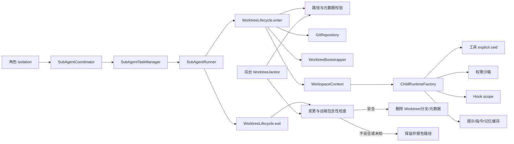

# FlickCode Worktree 隔离 Plan

## 架构概览

本功能采用独立 Worktree 生命周期服务，并把“当前工作区”提升为 Agent 运行时的显式上下文。生命周期服务只负责安全路径、Git、初始化、租约和清理；子 Agent 模块负责依据角色声明申请工作区；工具、权限、Hook、提示与上下文模块只消费解析后的绝对工作目录。

主流程如下：



设计拆为六层：

1. **配置与模型层**：定义隔离枚举、Worktree 配置、元数据、工作区上下文、安全报告和最终处置。
2. **路径与 Git 层**：纯路径校验、仓库文件系统探测、受控命令执行和 Git 状态查询。
3. **初始化层**：复制、链接、ignored 文件补齐和 Worktree 专属 hooks 配置。
4. **生命周期层**：创建、快速恢复、进入、退出、安全删除和活动租约。
5. **运行时传播层**：把绝对 `cwd` 传入 Agent Loop、工具、权限、Hook、上下文存储和资源加载。
6. **后台清理层**：按路径、归属、Git/变更三层过滤过期候选，并有界停止。

Fork 式和 `isolation: shared` 的定义式子 Agent 直接获得主项目的 `WorkspaceContext`，不经过任何 Git Worktree 创建逻辑。

## 配置格式

### 角色 frontmatter

`isolation` 是可选字段，默认 `shared`，从而保持现有角色兼容：

```yaml
---
name: implementer
description: Implement a focused change in an isolated checkout.
tools:
  allow: [read_file, write_file, edit_file, glob, grep, execute_command]
  deny: []
model: inherit
max_turns: 25
permission_mode: inherit
isolation: worktree
---
```

解析器把 `shared`、`worktree` 转为 `AgentIsolationMode`。旧角色缺少该字段时写入 `AgentIsolationMode.SHARED`。其他值仍按单角色诊断策略拒绝。

### 项目 Worktree 配置

环境初始化规则从主项目目录的 `.flickcode/worktrees.yaml` 读取，不并入现有用户级 Provider 配置，也不扩大 `.flickcode/config.yaml` 目前只为项目合并 MCP 的语义。

```yaml
version: 1
expiry_days: 7
bootstrap:
  copy:
    - .flickcode/config.local.yaml
  symlink:
    - .venv
    - node_modules
  ignored:
    - generated/runtime/*.json
```

规则含义：

- `copy`：源与目标都相对主/子项目根，复制普通文件或目录；拒绝源符号链接和规则冲突。
- `symlink`：在子项目相同相对位置创建指向主项目源的目录链接；源必须解析在主项目内，目标不得已存在。
- `ignored`：使用受限 glob 在主项目内枚举普通文件；每个候选再由 Git 确认处于 ignored 状态后复制。
- `expiry_days`：正整数，默认 7；配置缺失时不创建模板，使用空初始化规则。

路径规则只接受正斜杠相对路径，不允许空段、`.`、`..`、反斜杠、盘符或绝对路径。`copy`、`symlink` 和 `ignored` 的目标集合不能重叠。固定安全上限为：每次初始化最多 2,000 个复制文件、复制总量最多 512 MiB、单个 Git 命令最多 30 秒。

Worktree 托管根固定为 Git 仓库顶层的 `.flickcode/worktrees/`。服务把精确的 `/.flickcode/worktrees/` 规则写入仓库本地 `info/exclude`，不修改受版本控制的 `.gitignore`。

## 核心数据结构

### `AgentIsolationMode`

```python
class AgentIsolationMode(str, Enum):
    SHARED = "shared"
    WORKTREE = "worktree"
```

该枚举放在 `flickcode.worktrees.models`，由子 Agent 模块单向导入，供角色解析、启动规格和状态序列化共用。这样 `worktrees` 不需要反向导入 `subagents`。

### `WorktreeBootstrapConfig` 与 `WorktreeConfig`

```python
@dataclass(frozen=True)
class WorktreeBootstrapConfig:
    copy: tuple[str, ...] = ()
    symlink: tuple[str, ...] = ()
    ignored: tuple[str, ...] = ()

@dataclass(frozen=True)
class WorktreeConfig:
    expiry_days: int = 7
    bootstrap: WorktreeBootstrapConfig = WorktreeBootstrapConfig()
```

`WorktreeConfigLoader.load(project_root)` 返回配置与诊断。语法或安全校验失败时，Worktree 模式标记为不可用，但 Session、共享子 Agent 和 Fork 仍可运行。

### `RepositoryIdentity`

```python
@dataclass(frozen=True)
class RepositoryIdentity:
    repository_root: Path
    main_project_root: Path
    project_relative_path: Path
    common_git_dir: Path
    fingerprint: str
```

`repository_root` 是主 Git 顶层；`main_project_root` 是 FlickCode 启动目录；`project_relative_path` 用于在子 Worktree 中恢复同一子目录；`fingerprint` 由规范化仓库根和 common Git dir 生成。

`RepositoryLocator.probe_filesystem()` 向上查找 `.git` 目录或文件，并解析 `commondir`，不启动 Git。它足以定位已有受控 Worktree的快速恢复元数据。新建和删除前仍由 `GitRepository.validate_identity()` 使用 Git 复核。

### `WorktreeMetadata`

```python
@dataclass(frozen=True)
class WorktreeMetadata:
    schema_version: int
    repository_fingerprint: str
    logical_name: str
    worktree_root: Path
    project_root: Path
    branch: str
    base_commit: str
    created_at: datetime
    last_used_at: datetime
    initialization_state: str
```

元数据采用 UTF-8 JSON，存放在托管根 `.state/<logical-name-sha256>.json`，而不是 Worktree 内部，避免制造未跟踪修改。写入使用同目录临时文件、flush/fsync 和 `os.replace()`；读取只接受完整字段、版本 `1` 和规范化绝对路径。

目标目录存在时，`create()` 只按逻辑名称推导 sidecar 路径并读取目标 `.git` 文件与 JSON；不执行 Git、不更新时间、不重新初始化。`enter()` 在成功获得租约后才原子更新 `last_used_at`。

### `WorkspaceContext`

```python
@dataclass(frozen=True)
class WorkspaceContext:
    isolation: AgentIsolationMode
    project_root: Path
    repository_root: Path
    main_project_root: Path
    task_id: str
    logical_name: str = ""
    branch: str = ""
```

三个根路径在构造时全部 `resolve()`，且 `project_root` 必须位于 `repository_root` 内。共享模式三个根指向主目录/主仓库；Worktree 模式的 `project_root` 为 `worktree_root / project_relative_path`。

### `WorktreeHandle` 与 `WorktreeLease`

```python
@dataclass(frozen=True)
class WorktreeHandle:
    metadata: WorktreeMetadata
    workspace: WorkspaceContext
    recovered: bool

@dataclass
class WorktreeLease:
    handle: WorktreeHandle
    released: bool = False
```

只有生命周期服务可以构造租约。活动租约按规范化 Worktree 根登记，后台清理和显式删除必须先检查登记表。`release()` 和 `exit()` 幂等。

### `WorktreeSafetyReport` 与 `WorktreeOutcome`

```python
class WorktreeDisposition(str, Enum):
    NOT_USED = "not_used"
    REMOVED = "removed"
    RETAINED_CHANGES = "retained_changes"
    RETAINED_UNPUSHED = "retained_unpushed"
    RETAINED_CHECK_FAILED = "retained_check_failed"

@dataclass(frozen=True)
class WorktreeSafetyReport:
    clean: bool
    changed_paths: tuple[str, ...]
    unique_commits: tuple[str, ...]
    unpushed_commits: tuple[str, ...]
    diagnostics: tuple[str, ...] = ()

@dataclass(frozen=True)
class WorktreeOutcome:
    disposition: WorktreeDisposition
    path: Path | None
    branch: str
    reason: str
```

任何 Git 查询异常都生成 `RETAINED_CHECK_FAILED`，不尝试删除。

### 子 Agent 模型扩展

`AgentRoleDefinition` 增加 `isolation`。`SubAgentLaunchSpec` 增加 `workspace_request`，定义如下：

```python
@dataclass(frozen=True)
class WorkspaceRequest:
    isolation: AgentIsolationMode
    task_id: str
    logical_name: str

@dataclass(frozen=True)
class WorkspaceStatus:
    path: Path | None = None
    branch: str = ""
    recovered: bool = False
    disposition: WorktreeDisposition = WorktreeDisposition.NOT_USED
    reason: str = ""
```

定义式任务的逻辑名称固定为 `agents/<task-id>`。Fork 和共享角色使用 `SHARED` 请求。`SubAgentTaskRecord`、`SubAgentTaskSnapshot`、`AgentToolResponse` 和 `AgentNotification` 增加只读 `workspace` 摘要，但 Agent 工具的输入 schema 不变。

### 工具执行参数

所有 `BaseTool` 实现统一接受关键字参数：

```python
def execute(
    self,
    params: dict[str, Any],
    *,
    cwd: Path,
    file_cache: FileContentCache | None = None,
) -> ToolResult: ...
```

`cwd` 是不可省略的关键字参数，工具入口立即验证它是绝对目录。现有直接实例化工具的测试同步传入临时目录，防止兼容默认值重新引入进程当前目录。`AgentLoop` 新增不可变 `cwd` 和运行时私有 `file_cache`，权限检查和工具执行使用同一个值。

### `FileContentCache` 与 `WorkspaceResourceCache`

```python
@dataclass(frozen=True)
class FileVersion:
    mtime_ns: int
    size: int

class FileContentCache:
    def read_text(self, path: Path, encoding: str = "utf-8") -> str: ...
    def invalidate(self, path: Path) -> None: ...

class WorkspaceResourceCache:
    def instructions(self, project_root: Path, loader) -> InstructionBundle: ...
    def memory_index(self, index_path: Path) -> str: ...
    def system_prompt(self, key: PromptCacheKey, build) -> str: ...
```

文件键为规范化绝对文件路径，值同时保存 `FileVersion`；写工具成功后失效。指令缓存键包含绝对项目根及所有展开源文件的绝对路径与版本，项目记忆键为绝对 `index.md` 路径与版本，系统提示键首项为绝对项目根并包含角色、指令、记忆和日期指纹。缓存可以跨子 Agent 复用，但不能仅按相对路径、角色名或任务 ID 索引。

## 模块设计

### `flickcode.worktrees.config`

**职责：** 读取 `.flickcode/worktrees.yaml`，严格校验 schema、过期天数、三类规则和规则冲突。

**接口：**

```python
class WorktreeConfigLoader:
    def load(self, project_root: Path) -> tuple[WorktreeConfig, tuple[WorktreeDiagnostic, ...]]: ...
```

未知字段、未知版本、非正整数、重复规则、绝对路径、反斜杠和遍历段均为错误。文件不存在返回默认 7 天与空规则。

### `flickcode.worktrees.paths`

**职责：** 逻辑名称验证、托管布局、sidecar 定位、路径包含性和仓库文件系统探测。

**接口：**

```python
class WorktreeName:
    @classmethod
    def parse(cls, raw: str) -> "WorktreeName": ...
    def target(self, managed_root: Path) -> Path: ...

class WorktreeLayout:
    @classmethod
    def from_project(cls, project_root: Path) -> "WorktreeLayout": ...
    def state_path(self, name: WorktreeName) -> Path: ...
    def branch_name(self, name: WorktreeName, task_id: str) -> str: ...
```

`WorktreeName` 在纯字符串层先拒绝危险形式，再将目标 `resolve(strict=False)` 并用 `relative_to()` 复核。分支格式为 `flick/agents/<task-id>-<name-hash-8>`，其中 task ID 也要满足现有受控格式，最后调用 `git check-ref-format --branch`。

### `flickcode.worktrees.git`

**职责：** 所有 Git 子进程和 Git 语义查询；不含生命周期决策。

**接口：**

```python
class GitRunner:
    def run(self, args: Sequence[str], *, cwd: Path, timeout: float = 30.0) -> GitResult: ...

class GitRepository:
    def validate_identity(self, expected: RepositoryIdentity) -> None: ...
    def ensure_managed_root_excluded(self, layout: WorktreeLayout) -> None: ...
    def resolve_head(self) -> str: ...
    def validate_branch_name(self, branch: str) -> None: ...
    def add_worktree(self, path: Path, branch: str, base_commit: str) -> None: ...
    def configure_hooks(self, worktree_root: Path) -> None: ...
    def status_paths(self, worktree_root: Path) -> tuple[str, ...]: ...
    def unique_commits(self, worktree_root: Path, base_commit: str) -> tuple[str, ...]: ...
    def remote_refs_containing(self, commit: str) -> tuple[str, ...]: ...
    def list_worktrees(self) -> tuple[GitWorktreeEntry, ...]: ...
    def remove_worktree(self, path: Path) -> None: ...
    def delete_branch(self, branch: str) -> None: ...
```

`GitRunner` 固定使用参数数组、`shell=False`、显式绝对 `cwd`、UTF-8 replacement 解码、输出长度上限和超时；日志只记录动作与安全参数摘要。禁止拼接 shell 命令。

状态使用 `git status --porcelain=v1 -z --untracked-files=all`。唯一 commit 使用创建基线限定的 rev-list；每个唯一 commit 通过 `for-each-ref --contains <oid> refs/remotes` 查询。任意一个没有远端包含引用即为未推送。

删除时，在生命周期服务完成安全判断后，`remove_worktree()` 才可使用 Git 的强制物理清理能力以移除已声明 ignored 的初始化文件；这不是绕过保护，因为安全报告和身份复核是不可跳过的前置条件。随后只删除元数据记录的精确临时分支。

hooks 配置先读取主工作目录的有效 `core.hooksPath`；未设置时使用 common Git dir 的 hooks 路径。服务启用 Git 的 worktree config 支持后，仅对目标 Worktree 设置 `core.hooksPath`，不改写其他 Worktree 的值。

### `flickcode.worktrees.bootstrap`

**职责：** 执行配置声明的复制、目录链接和 ignored 文件补齐，生成可诊断初始化报告。

**接口：**

```python
class WorktreeBootstrapper:
    def apply(
        self,
        config: WorktreeBootstrapConfig,
        *,
        main_project_root: Path,
        child_project_root: Path,
        repository: GitRepository,
    ) -> BootstrapReport: ...
```

处理顺序固定为：预展开并验证全部规则与数量/大小 → 检查三类目标无冲突 → 复制 → 创建目录链接 → 配置 ignored 文件 → 配置 hooks。预检失败时不写目标；执行期失败时记录已经完成的动作并把元数据标记为 `failed`，不启动子 Agent，也不进行不确定的递归回滚。

目录链接使用平台原生 API并显式声明目录目标。Windows 无权限或平台不支持时返回失败；不调用 shell 版 `mklink`，也不退化为复制。

### `flickcode.worktrees.resources`

**职责：** 路径版本化文件缓存、指令/记忆加载和 Worktree 子 Agent 系统提示组装。

**接口：**

```python
class WorkspaceResourceCache: ...

class WorkspacePromptFactory:
    def build_defined_prompt(
        self,
        *,
        role_prompt: str,
        role_fingerprint: str,
        workspace: WorkspaceContext,
    ) -> str: ...
```

提示顺序为：角色正文 → 项目/用户指令 → 项目/用户记忆参考 → 受控环境。调用方只传角色正文与 fingerprint，资源模块不导入子 Agent 类型。项目指令与项目记忆从子 `project_root` 读取；用户指令与用户记忆从现有用户根读取。受控环境明确列出主/子路径、分支、平台和日期。

`InstructionBundle` 扩充已读取的绝对 `source_paths`，让包含文件变化能改变缓存版本。读取失败沿用现有诊断策略，不能退回主 Worktree 的同名内容。

### `flickcode.worktrees.lifecycle`

**职责：** 对外提供创建、恢复、进入、退出和安全删除，并维护进程内活动租约。

**接口：**

```python
class WorktreeLifecycle:
    def create(self, request: WorkspaceRequest) -> WorktreeHandle: ...
    def enter(self, request: WorkspaceRequest) -> WorktreeLease: ...
    def exit(self, lease: WorktreeLease) -> WorktreeOutcome: ...
    def inspect(self, handle: WorktreeHandle) -> WorktreeSafetyReport: ...
    def delete(self, handle: WorktreeHandle) -> WorktreeOutcome: ...
```

`enter(SHARED)` 返回主项目工作区租约，不创建元数据。`enter(WORKTREE)` 调用 `create()`；成功后登记活动租约并更新 `last_used_at`。同名生命周期操作由每名称锁保护，租约表由独立锁保护。

`create()` 先走“目标存在”分支，因此快速恢复不会触发 Git：名称校验 → 文件系统仓库探测 → 目标与 sidecar 有界读取 → 元数据交叉校验 → 返回 `recovered=True`。目标不存在才执行 Git 身份/HEAD/分支验证、排除规则、Worktree add、元数据和初始化。

`exit()` 先原子释放活动租约，再调用 `inspect()`。安全则 `delete()`，否则按优先级返回 changes、unpushed、check_failed。释放后的竞态由同名锁阻止后台清理抢占检查过程。

### `flickcode.worktrees.cleanup`

**职责：** 定期执行三层过滤，不持有 Agent 主循环线程。

**接口：**

```python
class WorktreeJanitor:
    def start(self) -> None: ...
    def run_once(self, now: datetime | None = None) -> CleanupReport: ...
    def close(self, timeout: float = 5.0) -> None: ...
```

Session 启动后以 daemon worker 立即异步扫描一次，之后每 60 分钟一次；每轮最多处理 256 个 state 候选。`run_once()` 先只读 sidecar 并完成路径/归属过滤，只有候选通过且过期才构造 handle 调用生命周期 Git 检查。关闭通过 Event 唤醒，不执行长时间 sleep，也不超过 5 秒等待。

### `flickcode.tools` 与 `AgentLoop`

**职责：** 消除隐式进程 `cwd`，让每次工具调用使用运行时工作区。

改动：

- `AgentLoop.__init__()` 增加必传的产品级 `cwd` 和可选运行时 `FileContentCache`；权限 `check()` 与 `tool.execute()` 都接收同一绝对路径。
- `ReadFileTool`、`WriteFileTool`、`EditFileTool` 用共享解析 helper 将相对路径拼到 `cwd`；读缓存按绝对路径和文件版本索引，写成功后失效。
- `GlobTool`、`GrepTool` 使用绝对 root 的 Path/glob 遍历，不调用 `os.chdir()`。
- `ExecuteCommandTool` 把 `cwd` 传给 `subprocess.run()`。
- `SkillScriptTool` 使用调用方 `cwd`，而不是构造时固定主项目根。
- `MCPToolAdapter`、`LoadSkillTool`、`AgentTool` 接收相同关键字但不改变远端参数 schema；它们不得读取进程 cwd。
- Session 中两处工具执行路径统一传 `self.project_root`；隔离 Skill 继续传其自身显式项目根。

### 权限、Hook 与上下文

`PermissionEngine.check()` 增加显式 `cwd`；`PathSandbox.check()` 对相对路径始终以构造时项目根解析。Worktree 子运行时使用 `workspace.project_root` 新建独立引擎，因此文件工具无法通过相对路径或链接逃回主项目。

`SubAgentHookScope` 使用子 `workspace.project_root` 作为 Hook 执行根，但复用父 Hook 的不可变 catalog 和后台设施。Hook 元数据增加工作区路径、分支与隔离模式；不包含初始化文件内容。

子 `ContextManager` 的存储目录为 `workspace.project_root/.tmp/subagents/context/<task-id>`，使用绝对路径。主 Agent 与其他 Worktree 不共享该目录。

### 子 Agent 集成

`SubAgentCoordinator` 仍生成 task ID 和稳定调用响应。定义式 `defined_spec()` 从角色写入 `WorkspaceRequest`；Fork `fork_spec()` 固定写入共享请求。

`SubAgentRunner.run()` 的顺序改为：

1. 检查取消；排队期取消直接结束，不申请工作区。
2. `lifecycle.enter(spec.workspace_request)`。
3. 向任务管理器回调 entered 状态，使运行期间可查询路径与分支。
4. `ChildRuntimeFactory.create(spec, token, lease.handle.workspace)`。
5. Agent Loop 跑到底。
6. `finally` 中执行一次 `lifecycle.exit(lease)` 并回调处置。
7. 保留原 Agent 终态；退出失败只写 `WorkspaceStatus.reason` 和诊断。

`SubAgentTaskManager.record_workspace()` 在任务锁下单向更新工作区状态。通知序列化只加入短路径/分支/处置摘要；完整错误仍由 result 查询，避免污染父上下文。

## 模块交互

### 首次创建并运行

```text
agent(start defined)
  → 角色解析 isolation=worktree
  → TaskManager 排队
  → worker 开始
  → Lifecycle.enter(agents/<task-id>)
      → 校验名称与仓库
      → 写 info/exclude
      → 解析 HEAD 与安全分支名
      → git worktree add
      → 写 metadata
      → bootstrap + hooks
      → 登记 lease / 更新 last_used_at
  → WorkspacePromptFactory 从子目录加载指令与记忆
  → ChildRuntime(project_root=子项目绝对路径)
  → AgentLoop 每个工具显式传 cwd
  → Lifecycle.exit
      → status + unique commits + remote refs
      → 安全则 remove；否则 retain
  → TaskManager 保存原终态和 WorktreeOutcome
```

### 快速恢复

```text
Lifecycle.create(name)
  → 名称和纯文件系统 repo probe
  → target 已存在
  → 读取 .state/<hash>.json 与 target/.git
  → 交叉检查绝对路径、repo fingerprint、name、ready 状态
  → 返回 recovered handle
```

该调用链没有 `GitRunner.run()`、环境初始化、元数据写入或 `last_used_at` 更新。随后 `enter()` 才获得租约并更新使用时间。

### 后台清理

```text
Janitor state 扫描（最多 256）
  → 路径过滤
  → 元数据/租约过滤
  → 过期判断
  → Git worktree 归属复核
  → 未提交修改检查
  → base..HEAD 唯一 commit
  → refs/remotes/* 包含性检查
  → 安全删除或保留并计数
```

## 文件组织

```text
src/flickcode/
├── agent.py                         # AgentLoop 显式 cwd 与工具执行传播
├── session.py                       # 主 Workspace、生命周期与 Janitor 装配/关闭
├── config.py                        # 不改变现有配置合并语义
├── tools/
│   ├── base.py                      # execute 的 cwd/file_cache 契约
│   ├── paths.py                     # 工具相对路径解析
│   ├── cache.py                     # FileContentCache
│   ├── read_file.py
│   ├── write_file.py
│   ├── edit_file.py
│   ├── glob_tool.py                 # 移除 chdir
│   ├── grep_tool.py                 # 移除 chdir
│   └── execute_command.py           # subprocess cwd
├── worktrees/
│   ├── __init__.py                  # 稳定导出
│   ├── models.py                    # 配置、元数据、handle、lease、报告
│   ├── config.py                    # worktrees.yaml 加载
│   ├── paths.py                     # 名称、布局、文件系统 repo probe
│   ├── git.py                       # GitRunner / GitRepository
│   ├── bootstrap.py                 # copy/symlink/ignored/hooks 初始化
│   ├── resources.py                 # 路径缓存与 Worktree prompt
│   ├── lifecycle.py                 # create/enter/exit/delete
│   └── cleanup.py                   # WorktreeJanitor
├── permissions/
│   ├── engine.py                    # check 显式 cwd
│   └── sandbox.py                   # 相对路径绑定项目根
├── memory/
│   ├── models.py                    # InstructionBundle source_paths
│   └── instructions.py              # 报告绝对来源路径
├── hooks/
│   └── actions.py                   # Hook 子进程显式项目 cwd（如需适配）
├── skills/
│   ├── executor.py                  # 隔离 Skill 显式 cwd
│   └── script_tool.py               # 调用方 cwd
└── subagents/
    ├── models.py                    # isolation/workspace 状态
    ├── roles.py                     # 可选 isolation frontmatter
    ├── runtime.py                   # lease 驱动的 ChildRuntime
    ├── coordinator.py               # WorkspaceRequest 组装
    ├── tasks.py                     # 运行中/终态 workspace 状态
    ├── notifications.py             # 处置摘要
    └── hooks.py                     # 子工作区 Hook scope

tests/
├── test_worktree_paths.py           # 名称、布局、元数据、repo probe
├── test_worktree_config.py          # 显式配置和边界
├── test_worktree_git.py             # Git 语义与远端包含性
├── test_worktree_bootstrap.py       # copy/link/ignored/hooks
├── test_worktree_lifecycle.py       # 创建/恢复/退出/删除/竞态
├── test_worktree_cleanup.py         # 三层过滤、过期和有界关闭
├── test_worktree_integration.py     # 双 Agent 端到端隔离
├── test_tools_workspace.py          # explicit cwd、缓存与零 chdir
├── test_subagent_roles.py           # isolation 解析回归
├── test_subagent_runtime.py         # workspace 注入
├── test_subagent_tasks.py           # workspace 状态与终态独立
├── test_subagent_integration.py     # Session 装配与兼容
├── test_permission_rules.py         # 子 Worktree 沙箱
├── test_hooks_integration.py        # Hook cwd/元数据
├── test_skills_executor.py          # Skill script cwd 回归
└── test_context.py                  # 上下文产物绝对隔离

docs/worktrees/
├── spec.md
├── plan.md
├── task.md
└── checklist.md

README.md                            # isolation、配置、保留/清理语义
```

## 技术决策

| 决策点 | 选择 | 理由 |
|---|---|---|
| 总体架构 | 独立 `worktrees` 生命周期服务 | Git 和删除安全可独立测试，后续合并与团队编排可复用，不把职责塞进子 Agent 运行时。 |
| 工作目录切换 | 显式绝对 `cwd`，禁止 `chdir` | 进程级 cwd 在线程间共享，无法支持真正并行隔离。 |
| 目录位置 | `<repo>/.flickcode/worktrees/` | 位于同一仓库内部、便于定位和清理；通过本地 exclude 隐藏，不提交生成目录。 |
| 忽略方式 | 修改 common Git dir 的 `info/exclude` | 不产生受版本控制改动，也能让所有 linked worktree 一致忽略托管根。 |
| 逻辑名称 | 小写 ASCII 严格分段 + 总长/层数限制 | 支持嵌套，同时消除盘符、反斜杠、Unicode 归一化和遍历歧义。 |
| 分支名 | 任务 ID + 名称哈希生成 | 不直接把模型文本当 Git ref，且能稳定关联任务并避免长名称/点规则冲突。 |
| 快速恢复 | sidecar + target `.git` 的只读校验 | 已存在路径不启动 Git，满足低延迟与“未知目录绝不接管”。 |
| 元数据位置 | 托管根 `.state/`，不放子 Worktree 内 | 避免元数据成为未跟踪修改并干扰退出判断。 |
| 初始化配置 | `.flickcode/worktrees.yaml` 显式 allowlist | 不猜测 `.env` 等秘密，项目行为可审计；不改变现有 config 合并语义。 |
| 初始化失败 | 阻止 Agent，保守保留 | 不让 Agent 在半初始化环境运行，也不对不确定目录做递归回滚。 |
| 大依赖处理 | 原生目录链接，失败即报错 | 避免静默复制大目录造成空间和性能问题。 |
| hooks | worktree-local `core.hooksPath` | 使用同一 hook 源但不让子目录配置覆盖其他 Worktree。 |
| 脏状态 | porcelain `-z` + 全部 untracked | 覆盖暂存、未暂存、重命名和未跟踪路径，解析不受空格换行影响。 |
| 未推送判定 | `base..HEAD` 每个新增 commit 检查所有 `refs/remotes/*` | 不依赖 upstream；只保护 Worktree 自创建后新增的 commit，不误算主分支既有本地历史。 |
| 安全删除 | 生命周期复核后调用 Git remove，再删精确分支 | 让 Git 维护 worktree 管理数据，同时所有破坏性动作都有不可跳过前置条件。 |
| 自动删除条件 | clean 且无未推送 commit | 与已确认需求一致；推送但未合并的 commit 由远端保存，合并策略不在本阶段。 |
| 后台清理 | 7 天默认、三层过滤、每小时有界扫描 | 及时回收无用目录，同时未知或有变更状态一律保留。 |
| Fork 行为 | 始终 shared | Fork 无角色 frontmatter，保持稳定 Agent 工具 schema，留待团队编排章节。 |
| 路径缓存 | 绝对路径 + 文件版本 | 切换 Worktree 无需清缓存，同一路径重建也不会命中旧内容。 |
| 多进程 | 不实现跨进程租约共享 | 当前子 Agent 并发由单 Session 管理；跨进程协调超出本阶段，Git 仍会拒绝明显冲突。 |

## Spec 覆盖检查

| Spec | 设计归属 |
|---|---|
| F1 | `AgentIsolationMode`、角色解析与兼容默认值 |
| F2 | `RepositoryLocator`、`GitRepository.resolve_head/add_worktree` |
| F3 | `WorktreeName`、`WorktreeLayout`、info/exclude 与分支生成 |
| F4 | `WorktreeLifecycle.create`、sidecar 原子读写与快速恢复分支 |
| F5 | `WorktreeConfigLoader`、`WorktreeBootstrapper`、hooks 配置 |
| F6 | `WorkspaceContext`、AgentLoop、全部工具、权限/Hook/Context cwd 传播 |
| F7 | `FileContentCache`、`WorkspaceResourceCache`、指令 source paths |
| F8 | Runner 的 enter 顺序、`WorkspacePromptFactory` |
| F9 | Runner finally、任务 workspace 状态与通知 |
| F10 | `WorktreeSafetyReport`、Git status/commit/remote refs 查询 |
| F11 | `WorktreeLifecycle.delete` 的身份、租约与 Git 复核 |
| F12 | `WorktreeLifecycle.exit` 的处置决策 |
| F13 | `WorktreeJanitor` 三层过滤和 7 天配置 |
| F14 | 每名称锁、活动租约、幂等退出与任务单向更新 |
| F15 | shared/Fork 快速路径、稳定 Agent 输入 schema、错误局部化 |

设计没有缺失的功能需求。接口依赖方向为 `subagents → worktrees → tools/permissions/memory`；`worktrees` 不反向导入 `subagents`，通过 `WorkspaceRequest`/回调集成，避免循环依赖。
